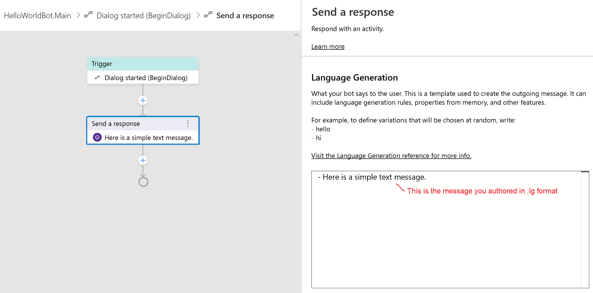
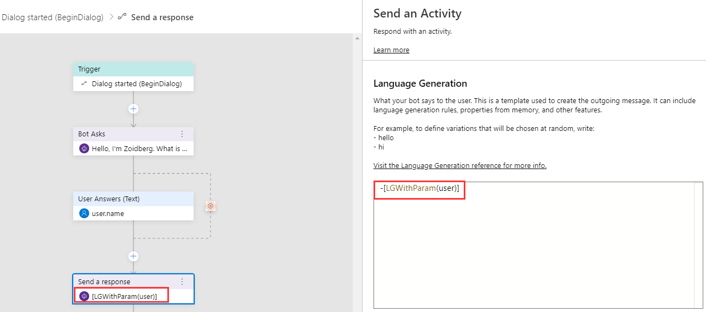

# Sending messages to users
The primary way a bot communicates with users is through message activites. Some messages may simply consist of plain text, while others may contain richer content such as cards or attachments. In this article, we will cover the different types of text messages you can use in Bot Framework Composer and how to use them. We use the examples provided in the [message sample](https://github.com/microsoft/BotFramework-Composer/tree/master/SampleBots/Message_Samples/ComposerDialogs) throughout this article. 

## User scenario
When your bot receives messages from the user, any **Intents** and **Entity** values in the message are extracted and passed on to the dialog's event handler. In the event handler you can define actions the bot should take to respond to the users. Sending messages back to the user is one type of action you can define in the event handler. 

Below is a screenshot of the **Send Messages** action component in Composer: 

> [!NOTE] All types of triggers have the **Send Messages** action component. The **Handle ConversationUpdate** trigger is one type of trigger used here for demo purposes. 

## What to know
In BF Composer, all messages that are sent back to the user are composed in the language generation (LG) editor and follow the [.lg file format](https://github.com/microsoft/BotBuilder-Samples/blob/master/experimental/language-generation/docs/lg-file-format.md). If you are not familiar with language generation in BF Composer, please read the [language generation](https://github.com/microsoft/BotFramework-Composer/blob/kaiqb/Ignite2019/docs/concept-language-genereation-draft.md) concept article. 

The table below lists five different types of text messages provided in BF Composer and their respective descriptions. 

| Message Type     | Description                                                                                  |
| ---------------- | -------------------------------------------------------------------------------------------- |
| Simple Text      | A simple LG defined to generate a single line text response. |
| Text With Memory | An LG template with pre-set property to generate a text response.    |
| Text With LG     | A reference to a pre-defined LG template to generate a text response. |
| LG With Parameter | An LG template with pre-set property as parameter to generate a text response. |
| LG Composition    | An LG template composed with other pre-defined templates to generate a text response. |

## Defining different text messages
To send a message, you need to specify **Send an Activity** and then in the the language generation inline editor you can author your response message in [.lg format](https://github.com/microsoft/BotBuilder-Samples/blob/master/experimental/language-generation/docs/lg-file-format.md). 

### Simple Text
To define a simple text message, use a "-" before the text that your want your bot to respond to users. 

     - Here is a simple text message. 

Below is a screenshot of the simple text message example in the [messages sample](https://github.com/microsoft/BotFramework-Composer/tree/master/SampleBots/Message_Samples/ComposerDialogs): 

### Text With Memory
To define a text message with memory, you need to **Set a Property** first and then use an expression response like this: 

     - {user.message} 

> [!NOTE] If you are not familar with setting a property in Composer, please refer to the [memory concepts](https://github.com/microsoft/BotFramework-Composer/blob/kaiqb/Ignite2019/docs/concept-memory-draft.md) introduced in the conversation flow article. If you are not familar with expression response format, please refer to the [Common Language Expression](https://github.com/microsoft/BotBuilder-Samples/tree/master/experimental/common-expression-language#readme) article. 

Below is a screenshot of the text with memory example in the [Messages_Samples](https://github.com/microsoft/BotFramework-Composer/tree/master/SampleBots/Message_Samples/ComposerDialogs): 

### Text With LG
Text with LG means a reference to a pre-defined LG template to generate a text response. It is achieved by markdown link notation by enclosing the target template name in square brackets - [TemplateName]. For example, you can define an LG templates named **TextWithLG** and reference this template as needed. 

     # TextWithLG
    - Hi, this is a text with LG
    - Hey, this is a text with LG
    - Hello, this is a text with LG 

Below is a screenshot that shows the reference of the pre-defined template named **TextWithLG** in the [message sample](https://github.com/microsoft/BotFramework-Composer/tree/master/SampleBots/Message_Samples/ComposerDialogs): 

### LG With Parameter
LG With Parameter means an LG template with pre-set property as parameter to generate a text response. To define LG with parameter, you need to include the parameter in the LG template. The template can then be referenced elsewhere. 

    # LGWithParam(user)
    - Hello {user.name}, nice to talk to you!

Below is a screenshot of the LG with parameter example in the [message sample](https://github.com/microsoft/BotFramework-Composer/tree/master/SampleBots/Message_Samples/ComposerDialogs): 

### Language Generation Composition
LG composition means to compose new LG template using pre-defined LG templates. To define an LG Composition you need to define the component template(s) first and then use the pre-defined templates as building blocks to compose a new LG Template. For example, you can define a **Greeting** LG template and then compose a new template named **LGComposition(user)** using the **Greeting** template. 

    # Greeting
    - nice to talk to you!

    # LGComposition(user)
    - {user.name} [Greeting]

Below is a screenshot of the text with LG Composition in the [message sample](https://github.com/microsoft/BotFramework-Composer/tree/master/SampleBots/Message_Samples/ComposerDialogs): 

## References 
- [Send and Receive Text Message](https://docs.microsoft.com/en-us/azure/bot-service/bot-builder-howto-send-messages?view=azure-bot-service-4.0)
- [Language Generation in Composer](https://github.com/microsoft/BotFramework-Composer/blob/kaiqb/Ignite2019/docs/concept-language-genereation-draft.md)
- [.lg file format](https://github.com/microsoft/BotBuilder-Samples/blob/master/experimental/language-generation/docs/lg-file-format.md)
- [Common Language Expression](https://github.com/microsoft/BotBuilder-Samples/tree/master/experimental/common-expression-language#readme)
- [Memory in Bot Framework Composer](https://github.com/microsoft/BotFramework-Composer/blob/kaiqb/Ignite2019/docs/concept-memory-draft.md)

## NEXT
TBD
