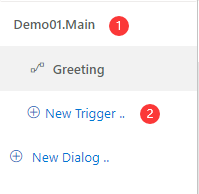
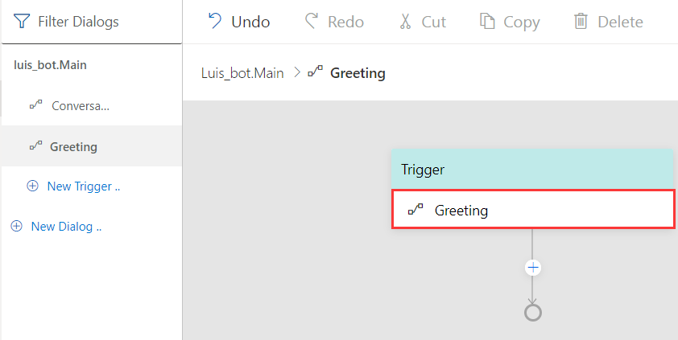
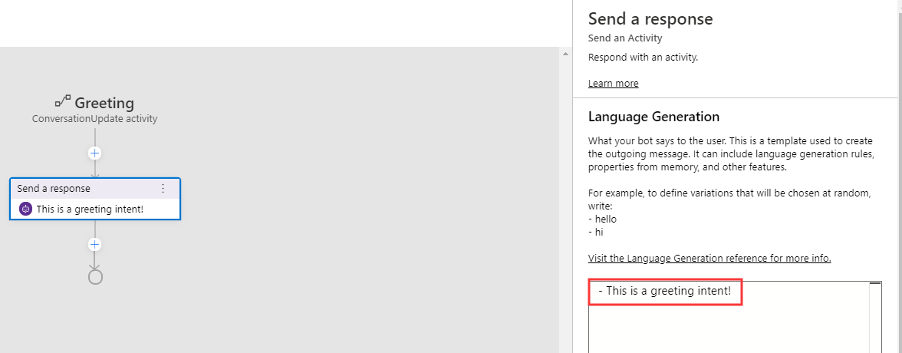

# Using LUIS for language understanding 
Language Understanding Intelligent Service ([LUIS](https://www.luis.ai/home)) is a cloud-based API service to build natural language into apps and bots. Adding LUIS to your bots enables them to understand the users' intents conversationally and contextually so that your bots can decide what to respond to the users. Bot Framework Composer provides tools to train and manage language understanding components and it's easier for developers to add LUIS when they develop bots with Composer. In this article, we will walk you through the steps to use LUIS when you develop your bots with Composer. To further explore how to use LUIS in Bot Composer, you may refer to the [ToDoBotWithLuisSample](https://github.com/microsoft/BotFramework-Composer/tree/master/Composer/packages/server/assets/projects/ToDoBotWithLuisSample). 

## Prerequisites 
- Basic knowledge of language understanding (concept article [here](./concept-language-understanding.md))
- Basic knowledge of events and triggers (concept article [here](./concept-events-and-triggers.md))
- LUIS account (apply [here](https://www.luis.ai/home))
- LUIS authoring key (how to get [here](https://docs.microsoft.com/en-us/azure/cognitive-services/luis/luis-concept-keys?tabs=V2#programmatic-key))

## How to add LUIS 
To determine user's intent, in Composer you define the `Intent` trigger, and then specify the actions to take when an **Intent** is recognized (and optionally **entities**). For more details please read the [events and triggers](./concept-events-and-triggers.md) article. 

Composer currently supports two types of recognizers: LUIS recognizer (default) and Regular expression recognizer. You can only choose one type of recognizer for each dialog. Besides the recognizer, each dialog may contain a set of language understanding data authored in [.lu format](https://github.com/microsoft/botbuilder-tools/blob/master/packages/Ludown/docs/lu-file-format.md).  

In this section, we will cover the steps to use LUIS as recognizer in your bot. These steps include the following: set a recognizer type for each dialog, author language understanding tranining data, publish your language understanding (LU) data, and test them in emulator. 

### Set LUIS as recognizer 
In Composer, each dialog can have one type of recognizer and might contain a set of language understanding training data. To add LUIS to your bot, you need to select LUIS as the recognizer type for the specific dialog you want to define. You need to do the following two things:

1. On the left side navigation pane, select the dialog you want to set LUIS recognizer.

2. On the property editor on the right side, select **LUIS** as recognizer type.

### Author language understanding (LU) content
Compose your language understanding training data in the LU editor. The training data should follow the [.lu file format](https://github.com/microsoft/botbuilder-tools/blob/master/packages/Ludown/docs/lu-file-format.md) and is ususally composed of two parts: intents and example utterances. You can author as many intents as you want to include in the specific dialog. The following screenshot shows **Greeting** and **CheckWeather** intents with the matching utterances.

### Define a `Intent` trigger 
After you compose the language understanding training data in specific dialog, you need to define a `Intent` trigger to handle the pre-defined intents. The `Intent` trigger is a type of event handler specialized to work with the **recognizers**. Each `Intent` trigger handles one intent. To define a `Intent` trigger you need to do the following two steps: create a `Intent` trigger and add actions to the `Intent` trigger. 

#### Create a `Intent` trigger 
To create a `Intent` trigger please do the following steps: 

1. select the dialog you want to create the `Intent` trigger on the left side navigation pane and 
2. click **New Trigger**. 

In the pop-up window, you do the following steps: 

1. select `Intent` as the trigger type from the drop-down menu
2. select the **intent** you want to handle with this trigger from the drop-down menu
3. click **Submit**. 

You need to define a `Intent` trigger for each **intent**. After the definition, you will see the name of the intent shown in the trigger node as follows:  

#### Add actions to the `Intent` trigger 
After you define your trigger and configure it to specific intent, you can add actions to be executed after the trigger is fired. For example, you can send a response message. 

To send a response message, please do the following three steps: 

1. click the " + " sign below the trigger node and 
2. select **Send a response**. 
3. define the response message in the language generation editor in the [.lg file format](https://github.com/microsoft/BotBuilder-Samples/blob/master/experimental/language-generation/docs/lg-file-format.md).

The screenshot below shows how to author a response message "This is a Greeting intent!" in the language generation editor. 

You can add your desired action to each `Intent` trigger. 

### Publish 
When you finish defining all the triggers and language understanding training data, you can publish your language understanding content from Composer to LUIS. 
To publish the LU content, please do the following steps: 
1. click **Start Bot** on the upper right corner of your Composer
2. fill in your LUIS authoring key and 
3. click **Publish**. 

Any time you hit **start bot** (or **restart bot**), Composer will evaluate if your LU content has changed. If so Composer will automatically make required updates to your LUIS applications, train and publish them. If you go to your LUIS app website, you will find the newly published LU model. 

### Test 
To test your bot which you just added LUIS to, click the **Test in Emulator** button on the upper right corner of Composer. When you emulator is running, send in messages indicating different intents to see if they match the pre-defined intents. 

## References 
- [LUIS.ai](https://www.luis.ai/home)
- [Add natural language understanding to your bot](https://docs.microsoft.com/en-us/azure/bot-service/bot-builder-howto-v4-luis?view=azure-bot-service-4.0&tabs=csharp)
- [Events and triggers](./concept-events-and-triggers.md) 
- [Language understanding](./concept-language-understanding.md)

## Next 
Learn [how to add a QnA Maker knowledge base to your bot](./how-to-add-qna-to-bot.md). 

