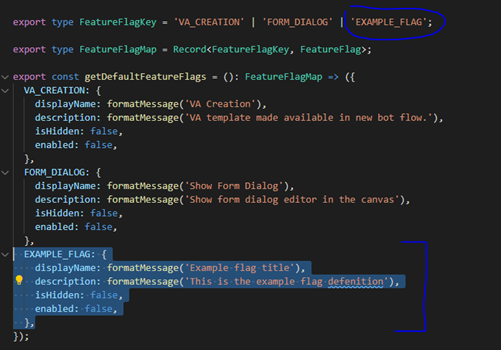
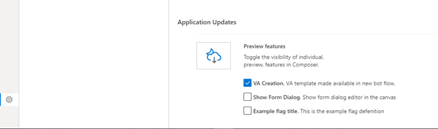
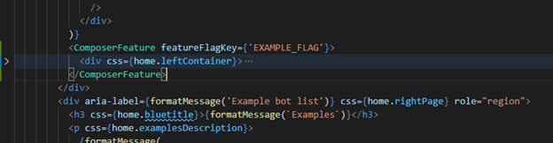
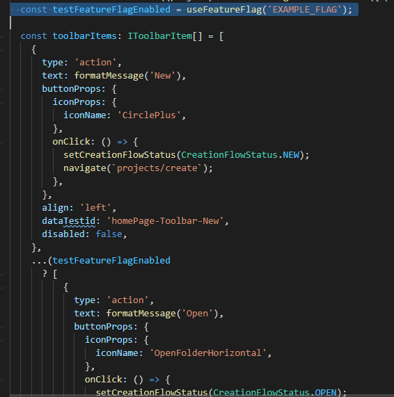
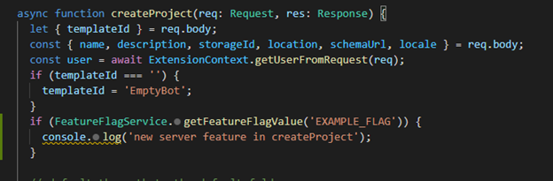

# Feature Flags
## Overview
The following documentation walks developers thorough feature flag usage and creation in Composer. There is also guidance on when to use certain feature flag types as well as how to toggle hidden and visible feature flags in different environments.

## Feature Flag Creation
- Go to ~\Composer\packages\types\src\featureFlags.ts
    - Add a feature flag key to FeatureFlagKeys
- Go to ~\Composer\packages\lib\shared\src\featureFlagUtils\index.ts
    - Add a feature flag object that uses that key to getDefaultFeatureFlags function.
        - Add displayName and description values for your feature flag, these will appear in the UI where the user can toggle the feature on or off.
        - Indicate whether you want your feature flag to be hidden or not
            - Hidden feature flags are not changeable through the UI and intended for in development or private preview features.
            - Visible feature flags are used for features in public preview that are mature enough for any end user to use.

    

-	Build @bfc/shared and run Composer
-	Navigate to the app settings page and validate that any feature flags that you added that have hidden = false are now visible in the app settings page
    

## Feature Flag Usage
Now that you have created your feature flag you have what you need to put your new feature code behind this flag. You can do this a few different ways depending on the type of feature you are implementing.

### Front end React.node feature
If your feature is integrated into the Composer UI as a React node then you can pass that react node as a child to the <ComposerFeature > higher order component.
For example, say your “feature” was the tutorials UI in home.tsx (denoted below as `
…)`, then the below addition of <ComposerFeature> would tie that UI to the feature flag value you added in the previous step

### Front end feature that is not integrated as a React.node
There are scenarios in which a feature is integrated with the front end through other means then jsx code. In those scenarios you can use the useFeatureFlag(key: FeatureFlagKey) hook to get the value of a given feature flag.
The below example uses the useFeatureFlag hook to determine whether a not a “feature” should be included in toolbar Items.

### Server-side Feature
Feature flag state is maintained at parity between the server and client workspaces. So if you have server side code that you want to put behind a feature flag it is possible. That being said most feature scenarios will likely gate off entry point in the client side such that server side feature code can’t be hit.

Feature flag state on the server can be accessed through FeatureFlagService.currentFeatureFlagMap and if you need a specific value, FeatureFlagService. getFeatureFlagValue(featureFlagKey: FeatureFlagKey). For example the below code would conditionally add a step to the createProject server flow.

### Extension feature
Feature flag state not yet surfaced to extensions.

## Toggling hidden Feature Flags
Non hidden feature flags are toggleable through the app settings page in Composer. Hidden feature flags can be configured by the end user in a few different ways depending on your environment.

### Electron app
Currently no way yet to set feature flags in downloaded electron app

### Dev env
Feature flag values are stored in data.json. In a development environment where you have direct access to this file you can toggle the value for hidden and non hidden feature flags directly in data.json.
Next iteration task items:

## Work items for R12
Tracked [here](https://github.com/microsoft/BotFramework-Composer/issues/4513).
- Add UI and back end functionality to toggle all feature flags to false at once (per design spec)
- Add feature flag groups (per design spec)
- Feature flag values available to extensions
- Add ability to configure hidden feature flags when running electron app
- Crete unit tests for all feature flag scenarios
