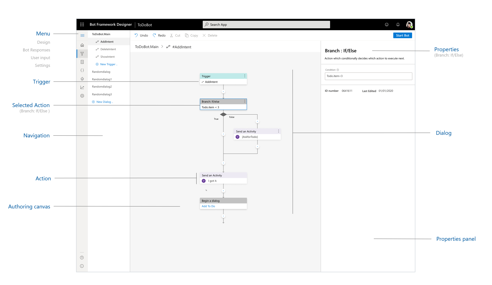
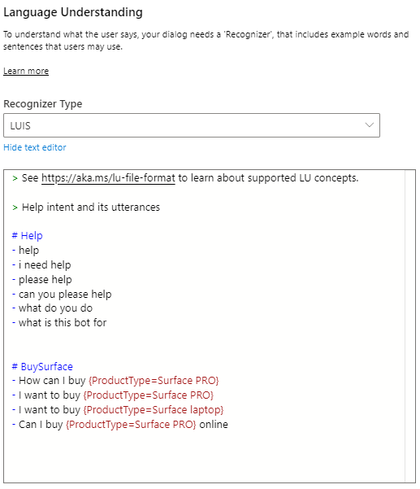
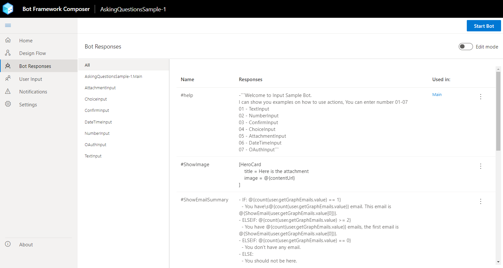

# Introduction to the Bot Framework Composer

The Bot Framework Composer is an integrated development tool that developers and multi-disciplinary teams can use to build bots. It is built using the latest features of the Bot Framework SDK. Within Composer, you'll find everything you need to build a sophisticated conversational experience:

* A visual dialog editor.
* Tools to train and manage Language Understanding (LU).
* Powerful language generation and templating systems.
* A ready-to-use bot runtime executable .

Under the hood, Composer harnesses the power of many of the components from the Bot Framework SDK. When building bots in Composer, developers will have access to:

**Adaptive dialogs**

Dialogs provide a way for the bot to manage conversations with the user. The new [Adaptive dialog](https://github.com/microsoft/BotBuilder-Samples/tree/master/experimental/adaptive-dialog) and the event model simplify sophisticated conversation modelling and helps you focus on the model of the conversation rather than the mechanics of dialog management. 

**Language Understanding (LU)**

LU is a core component of Composer, allowing developers and conversation designers to train language understanding directly in the context of editing a dialog. As dialogs are edited in Composer, developers can continuously add to their bots' natural language capabilities using the [lu file format](https://aka.ms/lu-file-format), a simple markdown-like format that makes it easy to define new [intents](concept-language-understanding.md#intents) and provide sample [utterances](concept-language-understanding.md#utterances). In Composer, you can use both regular expression or [LUIS](https://docs.microsoft.com/azure/cognitive-services/luis/what-is-luis) service. 

  

Composer detects changes and updates the bot's cloud-based natural-language understanding (NLU) model automatically so it is always up to date.

**Language Generation (LG)** 

Creating grammatically correct, data-driven responses that have a consistent tone and convey a clear brand voice has always been a challenge for bot developers. Composer's integrated [Language Generation](https://github.com/microsoft/BotBuilder-Samples/tree/master/experimental/language-generation) system allows developers to create bot replies with a great deal of flexibility.

  

With Language Generation, previously complex tasks can be quickly achieved, like:
* Including dynamic elements in messages.
* Generating grammatically correct lists, pronouns, articles.
* Providing context-sensitive variation in messages.
* Creating Adaptive Cards attachments, as seen above.

**QnA Maker**

[QnA Maker](https://docs.microsoft.com/azure/cognitive-services/qnamaker/overview/overview) is a cloud-based Natural Language Processing (NLP) service that easily creates a natural conversational layer over your data. It can be used to find the most appropriate answer for any given natural language input, from your custom knowledge base (KB) of information.

**Bot Framework Emulator**

[Emulator](https://github.com/Microsoft/BotFramework-Emulator/blob/master/README.md) is a desktop application that allows bot developers to test and debug bots built using Composer.

## Advantage of developing bots with Composer
Developers familiar with the Bot Framework SDK will notice differences between bots developed with it and the Bot Framework Composer. Some of the advantages of developing bots in Composer include:
- Use of Adaptive Dialogs allow for Language Generation (LG), which can simplify interruption handling and give bots character.
- Visual design surface in Composer eliminates the need for boilerplate code and makes bot development more accessible. You no longer need to navigate between experiences to maintain LU model as it is editable within the app.
- Time saved with fewer steps to set up your environment.

A major difference between the current version of the Bot Framework SDK and Composer is that the apps created using Composer uses the Adaptive dialog format, a JSON specification shared by many tools provided by the Bot Framework. More information about Adaptive dialog is available on [GitHub](https://github.com/microsoft/BotBuilder-Samples/tree/master/experimental/adaptive-dialog).

<!--Composer assets such as Dialogs, Language Understanding (LU) training data, and message templates can be managed like any other developer asset. They are files that can be committed to source control and deployed with code updates.-->

The Composer bot projects contain reusable assets in the form of JSON and Markdown files that can be bundled and packaged with a bot's source code. These can be checked into source control systems and deployed along with code updates, such as dialogs, language understanding (LU) training data, and message templates.

## Additional resources
- [Bot Framework SDK](https://github.com/microsoft/botframework-sdk/blob/master/README.md)
- [Common Expression Language](https://github.com/microsoft/BotBuilder-Samples/tree/master/experimental/common-expression-language)

## Next steps

* Learn how to [create an echo bot](./quickstart-create-bot.md) using Composer.
