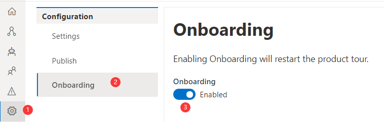
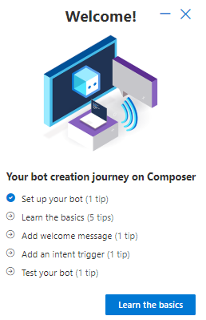

# Onboarding 

Bot Framework Composer provides an `Onboarding` functionality to get new users familiar with their bot creation journey. This functionality includes coach marks and teaching bubbles informing  users of the basics when they learn how to create their first bots using Composer. To enable `Onboarding`, follow the steps: 

Click **Settings** (the wheel-shaped icon) on the navigation pane then click **Onboarding**. Toggle **Onboarding** to **Enabled**. See the screenshot below: 

After you enable the `Onboarding` functionality you will see the overview pane popup at the bottom right corner of the screen. The overview pane contains five steps for the onboarding process. Each step includes the number of tips in the brackets. Click **Learn the basics** and you will start your bot creation journey. 

You can navigate the tips back and forward by clicking the `Next` or `Previous`button in the middle of one step. 

Click anywhere outside the overview pane you will see a popup window asking if you would like to `Leave Product Tour`.  If you select **Yes** your onboarding process will end. If you select **Cancel** your onboarding process resumes. 

Whenever one step finishes you will be navigated back to the overview pane and you should click the next step until the whole onboarding process is completed. You need to enable the `Onboarding` functionality every time you want to start a new onboarding process. 

## Next 
- Learn [how to build a weather bot](./tutorial/bot-tutorial-introduction.md). 
