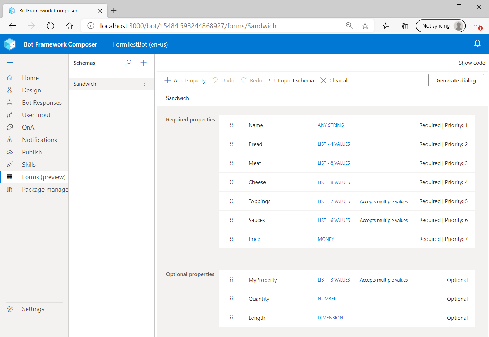
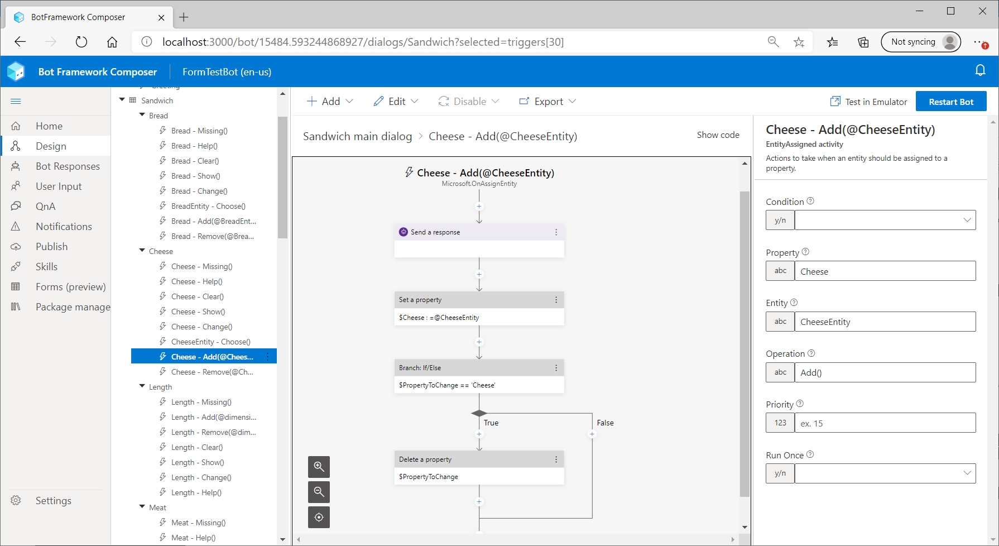

# Form dialogs in Bot Framework Composer

Bots that feel natural to converse with can be complicated to develop. Rather than following a strict conversational flow, they need to seamlessly handle conversations in which a user gives multiple answers or unexpected responses, including interruptions that cause the conversation to flow in any order.

The forms dialogs feature in Composer is designed to help developers more easily create bots that feel natural by providing a graphical interface to create a form that Composer uses to generate a dialog using the Bot Framework SDK's [dialog generation](https://github.com/microsoft/BotBuilder-Samples/tree/main/experimental/generation) API. The resulting dialog has capabilities built in to enable it to better handle these types of interruptions to the bot's conversational flow.

When Composer generates a dialog from a form, all of the dialogs assets are automatically created for you, including the bot responses and user input that you would normally create manually. You simply define the properties you want in the form schema, and the dialog assets are automatically generated.

## Enabling Forms (preview) in Composer

Follow these steps to enable Forms (preview) in Composer:

1. Install [Bot Framework Composer](https://docs.microsoft.com/composer/install-composer#build-composer-from-source) and run it.
1. From the **Home** page, select **New** to create a new bot or open an existing bot. A bot needs to be open in order to use the Forms feature in Composer.
1. Next, select **Settings** from the Composer menu, then **Application settings** in the navigation pane.
1. In the **Preview features** section, select the **Form dialogs** checkbox.

You can now select **Forms (preview)** from the Composer menu.

## Creating and connecting a form dialog

The following steps describe how to create a form, use it to generate a dialog, and how to connect that dialog to your root dialog.

### Create a form

The form defines the properties your bot will use and the values that are acceptable to each property. These properties can be defined as an enumerated list of values or as a property type, such as date, time, name, phone number, age, email address, string or number.

1. Select **Forms (preview)** from the Composer menu.
2. Create a new schema by selecting the plus sign (**+**) in the **navigation pane**.
3. In the resulting **Create form dialog** window, enter a name then select the **Create** button. This will be the name of your schema as well as the dialog generated from it.
4. Select the schema you just created in the list of **Schemas** that appears in the **navigation pane**. The schema editor will appear in the **authoring canvas**.
5. Select **Add property** in the **authoring canvas**.
6. A new property card will appear. Provide a **Property Name** and select a **Property Type** from the drop down list.

    Below is a screen shot showing a schema with properties of a sandwich:

    

> [!TIP]
>
> Here are some helpful tips about properties:
>
> - **Required properties** are properties that your bot will ask the user to provide. The user must provide values for all required properties.
> - **Optional properties** are properties the bot accepts if given but does not ask for. <!-- How does a user provide values to these if they are not prompted for them? -->
> - **Priority** refers to the order in which the bot will ask for the required properties.
> - Properties are defined as required by default and prioritized by the order that they appear in the form. **Drag and drop** a property card to change the property's priority or to make it optional.

### Generate dialog

When your schema is complete, generate a new dialog from it. Once your new dialog is created you can inspect it, then connect to it from your bot's main dialog.

1. Select the **Generate dialog** button located in the **authoring canvas** to create a new dialog from the schema.
1. Navigate to your new dialog by selecting the dropdown menu from your schema name or selecting **Design** from the Composer main menu. The new dialog will appear in the list of dialogs in the **navigation pane**.

    The triggers for the dialog will be grouped by property along with a group for form-wide triggers.

    

> [!TIP]
>
> Each property has a set of triggers and actions:
>
> - **Missing**: Fires when the property value is missing. The bot sends a message to the user asking for a value and expects a response. The **Missing()** trigger is created only for required properties.
> - **Help**: Fires when the bot is expecting a value for this property and user instead asks for help. The bot sends a message that describes the values acceptable for this property.
> - **Clear**: Fires when the user asks to clear this property. The bot sends a confirmation message and deletes the property.
> - **Show**: Fires when the user asks to show this property. The bot sends a message that shows the property name and value.
> - **Change**: Fires when the user asks to change this property. The bot sends a message asking the user what value they like to use instead.
> - **Choose**: Fires when the user gives a value that is similar to multiple acceptable values. The bot sends a message asking the user to choose betweeen the possible value. The **Choose** trigger is created only for properties that have acceptable values that are similar.
> - **Add**: Fires when the user specifies a property value, either when expected by the bot in response to a **Missing** trigger or unexpected by the bot. The bot sends a message confirming the value, if unexpected, and sets the property.
> - **Remove**: Fires when the user asks to remove a value. The bot sends a message confirming the value and sets the property.

### Connect new dialog to the main dialog

You can connect your form dialog to your  dialog as you would any child dialog. For example, if you'd like to invoke your form dialog from the root, you can add a new trigger:

1. From your main dialog, select the **Add** dropdown and select the **Add a new trigger**.
1. In the **Create a trigger** window, select the trigger type **Intent recognized**.
    > [!NOTE]
    > If your main dialog is using the default recognizer, add example trigger phrases. Add a condition `=turn.recognized.score > 0.8` to prevent your form from restarting.
    <!--- How? ----------------------------------------------------------------------------------------------------------------------------------------------------------->
    <!--- How? ----------------------------------------------------------------------------------------------------------------------------------------------------------->
1. Select the plus sign (**+**) in the **authoring canvas** to create a new action, then select **Begin a new dialog** from the **Dialog management** drop down list. Alternatively, you can add a **Begin a new dialog** node as an action in an existing trigger.
1. Select the dialog you created from the **Dialog name** drop down in the **properties panel**.

You can now run your bot with your form dialog.

## Editing language assets
<!--- How? ----------------------------------------------------------------------------------------------------------------------------------------------------------->
Dialog generation creates the .dialog files as well as the bot responses (LG) and language understanding model (LU). We recommend editing the text of the bot responses or the user inputs as opposed creating new templates and models or deleting existing ones.

### Editing bot responses (LG)

To edit all of the bot responses possible with your form dialog, go to the **Bot responses** section and select your form dialog. The form dialog will group all the bot responses by property. The template name indicates the context in which the response will be given, so you can edit all the bot responses for a property in one location.

<!-- add a screenshot -->

Alternatively, you can also edit bot responses from the flow diagram of your form dialog.

### Editing language understanding models (LU)

Similar to bot responses, you can edit all the language understanding specific to a property in one location. Go to the "User input" section and select your form dialog. The form dialog will group all the example utterances by property.

<!--- eventually add link to separate document explaining in the LUIS model.-->

## Updating the form dialog

As you continue to develop your bot, you might decide to add, edit, or remove properties from your form. You can make changes to your form and regenerate your dialog by pressing the **Generate dialog** button. Your dialog, bot responses, and language understanding model will be updated without losing your prior customizations.
