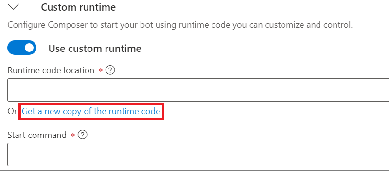

# Orchestrator Preview
Orchestrator is a powerful new language model that is optimized for conversational AI applications.

- [Technical Overview](https://github.com/microsoft/botframework-sdk/blob/main/Orchestrator/docs/Overview.md)
- [Samples](https://github.com/microsoft/BotBuilder-Samples/tree/main/experimental/orchestrator)

TODO: mention selling points here
- Easy to use - Use your existing LU files from LUIS
- State of the Art - BERT model
- Extremely fast Inference Time: Written in C++ native code
- Cross-platform Support: Runs on Windows, Linux and Mac OS X
- Free to use: Deploy the language models alongside your bot, there are no service charges or usage fees

## Getting Started
------------------

For this preview, please be aware of these limitations:

1. Orchestrator has to be deployed on an x64 platform. If you are deploying your bot from Visual Studio or from a pipeline, please be aware that you need to publish your bot with `win-x64` enabled

1. We are supporting English only at this point in time.  Multi-Lingual support is scheduled for 2nd Quarter of 2021.

1. Orchestrator supports intents only.

Please see the schedule for when new features will be added to Orchestrator


### Adding Orchestrator to a new bot in Composer
1. Enable the preview feature in Orchestrator:
    - Navigate to `Application Settings` (
     icon)
    - Enable Orchestrator preview feature under `Applicatio Updates -> Preview features`

      

1. Create a new bot, or open an existing bot project. Select a dialog in the bot project that you would like to try Orchestrator with. Select `Orchestrator recognizer` from the `Recognizer Type` dropdown

   

1. Create an intent trigger
    - Click on the waffle menu on a dialog to add a new trigger
    
    - Create a new `Intent recognized` trigger, and fill in the intents for your dialog in LU format. For more details on the LU format, please see [here](https://docs.microsoft.com/en-us/azure/bot-service/file-format/bot-builder-lu-file-format?view=azure-bot-service-4.0)
    - Add a response to the new `Intent Recognized` trigger to test that Orchestrator is working
        - In the flow diagram for the newly created trigger, click on the `+` button and select `Send a Response` from the dropdown, then add a sample response in the `Language Generation` textbox.

1. Modify the runtime to support Orchestrator
    1. Eject the runtime to add Orchestrator libraries to the runtime
        1. Navigate to `Application Settings` (
            ) and toggle the `Use custom runtime` switch. Then click on `Get a new copy of the runtime code` and select `C#` to eject a copy of the dotnet runtime for your bot. Click `Okay`.

            
        1. The runtime will be ejected into the `<Bot Project Folder>/runtime/azurewebapp` folder of your  bot project.

    1. Perform these modifications to add Orchestrator Recognizer support to your newly ejected runtime:
        1. Open `<Bot Project Folder>/runtime/azurewebapp/Microsoft.BotFramework.Composer.WebApp.csproj`:

            - Add `Microsoft.Bot.Builder.AI.Orchestrator` after `Microsoft.Bot.Builder.AI.Luis`
                ```xml
                <ItemGroup>
                <PackageReference Include="Microsoft.AspNetCore.Mvc.NewtonsoftJson" Version="3.1.2" />
                <PackageReference Include="Microsoft.Bot.Builder" Version="4.11.0" />
                <PackageReference Include="Microsoft.Bot.Builder.AI.Luis" Version="4.11.0" />
                <PackageReference Include="Microsoft.Bot.Builder.AI.Orchestrator" Version="4.11.0-preview" />
                ...
                ```
                **Important: All packages starting with `Microsoft.Bot.Builder` must have the same version numbers. For example, if your ejected runtime `Microsoft.Bot.Builder` version is `4.11.0` like above, set the `Microsoft.Bot.Builder.AI.Orchestrator` version to `4.11.0-preview`.**

            - Find these lines:
                ```xml
                <PropertyGroup Condition="'$(Configuration)|$(Platform)'=='Release|AnyCPU'">
                    <CodeAnalysisRuleSet>..\core\Microsoft.BotFramework.Composer.Core.ruleset</ CodeAnalysisRuleSet>
                </PropertyGroup>
                <PropertyGroup Condition="'$(Configuration)|$(Platform)'=='Debug|AnyCPU'">
                    <CodeAnalysisRuleSet>..\core\Microsoft.BotFramework.Composer.Core.ruleset</CodeAnalysisRuleSet>
                </PropertyGroup>
                ```
                Modify these lines by adding the x64 `PlatformTarget` so they look like this:
                ```xml
                <PropertyGroup Condition="'$(Configuration)|$(Platform)'=='Release|AnyCPU'">
                    <CodeAnalysisRuleSet>..\core\Microsoft.BotFramework.Composer.Core.ruleset</ CodeAnalysisRuleSet>
                    <PlatformTarget>x64</PlatformTarget>
                </PropertyGroup>
                <PropertyGroup Condition="'$(Configuration)|$(Platform)'=='Debug|AnyCPU'">
                    <CodeAnalysisRuleSet>..\core\Microsoft.BotFramework.Composer.Core.ruleset</CodeAnalysisRuleSet>
                    <PlatformTarget>x64</PlatformTarget>
                </PropertyGroup>
                ```

        1. Compile the project for x64. Look for these lines
        1. Open `<Bot Project Folder>/runtime/azurewebapp/Startup.cs` and add these lines:
            1. Add the Orchestrator dependency after `Microsoft.Bot.Builder.AI.Luis`:
                ```csharp
                using Microsoft.Bot.Builder.AI.Orchestrator;
                ```
            1. Add registration for Orchestrator after `ComponentRegistration.Add(new LuisComponentRegistration());`:
                ```csharp
                ComponentRegistration.Add(new OrchestratorComponentRegistration());
                ```
        1. Open `<Bot Project Folder>/runtime/core/ComposerSettingsExtensions.cs` and add these lines at the bottom of the file, before returning the `builder` object:
            ```csharp
            var orchestratorSettingsPath = Path.GetFullPath(Path.Combine(botRoot, "generated", "orchestrator.settings.json"));
            var orchestratorSettingsFile = new FileInfo(orchestratorSettingsPath);
            if (orchestratorSettingsFile.Exists)
            {
                builder.AddJsonFile(orchestratorSettingsFile.FullName, optional: false, reloadOnChange: true);
            }
            ```
    1. Return back to Composer.  Click the `Start Bot` button to start the bot and Orchestrator locally and test the bot in the emulator. When the dialog is hit, Orchestrator will show up in the logs as `Orchestrator Recognition`.
    

