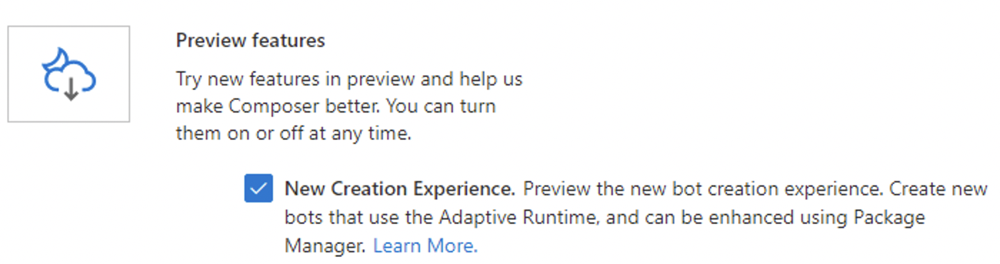

# Orchestrator preview
Orchestrator is a powerful LU solution optimized for conversational AI applications.

Read more about Orchestrator [here](https://aka.ms/bf-orchestrator).

- [Technical Overview](https://github.com/microsoft/botframework-sdk/blob/main/Orchestrator/docs/Overview.md)
- [Samples](https://github.com/microsoft/BotBuilder-Samples/tree/main/experimental/orchestrator)

## Orchestrator features
- Easy to use - Use your existing LU files from LUIS without modification
- State of the art - Extensive pre-trained transformer-based models for conversational applications
- Extremely fast inference time: Written in C++ for performance
- Cross-platform support: Runs on Windows, Linux and Mac OS X, including Cloud platforms
- Supports a [large number of languages](https://github.com/microsoft/botframework-sdk/blob/main/Orchestrator/docs/NLRModels.md#pretrained20210205microsoftdte0006unicoder_multilingualonnx) out of the box
- Free to use: Language models are deployed alongside your bot and runs in memory. No external services required

## Getting started

### Limitations
For this preview release, please be aware of these limitations:

1. It is recommended to deploy Orchestrator on the `x86-64` platform. On Azure, it is recommended to publish your bot application with the `win-x64` [runtime identifier](https://docs.microsoft.com/en-us/dotnet/core/tools/dotnet-publish), or use Composer's built-in Azure deployment to do this automatically.

1. Orchestrator does not support entity extraction for this release. Any entities declared in your LU file will be ignored.

1. A default base model is provided with this release. Future models will be made available for Composer users at a later date.

Please see the [roadmap](https://github.com/microsoft/botframework-sdk/blob/main/Orchestrator/docs/Overview.md#Roadmap) for when these features will be added to Orchestrator.


### Adding Orchestrator to a new bot in Composer
Starting in Composer v1.4, Orchestrator is available as a downloadable package for your bot.  To enable Composer's new Package Manager and Orchestrator preview features, please follow these steps:
1. Enable the 'New Creation Flow' from the preview features list:
    - Navigate to `Application Settings` (
     icon)

    - Enable the  `Application Updates -> Preview features`

      

1. Create a new bot in Composer (`Home -> New`). Select any bot template.

1. After the bot project has been initialized, navigate to the `Package Manager` tab. Download and install the `Microsoft.Bot.Components.Orchestrator` package.

    

1. After the package has been successfully installed, navigate back to the `Design` tab. Select a dialog in the bot project that you would like to try with Orchestrator. Select `Orchestrator recognizer` from the `Recognizer Type` drop-down menu.

    

1. Create an intent trigger
    - Click on the waffle menu on a dialog to add a new trigger

        

    - Create a new `Intent recognized` trigger, and fill in the intents for your dialog in LU format. For more details on the LU format, please see [here](https://docs.microsoft.com/en-us/azure/bot-service/file-format/bot-builder-lu-file-format?view=azure-bot-service-4.0).

        

    - Add a response to the new `Intent Recognized` trigger to test that Orchestrator is working
        - In the flow diagram for the newly created trigger, click on the `+` button and select `Send a Response` from the dropdown, then add a sample response in the `Language Generation` textbox.

1. Click the `Start Bot` button to start the bot locally and test the bot in the emulator. When the dialog is hit and Orchestrator is loaded successfully, test your bot in the Emulator. Orchestrator will show up in the logs as `Orchestrator Recognition`.
     

## Publishing an Orchestrator-based bot to Azure
While it is possible to deploy your bot using your own scripts, it is strongly recommended to use Composer to publish your bot to Azure. Please see the documentation [here](https://docs.microsoft.com/en-us/composer/how-to-publish-bot).

The Composer deployment will create an S1 Tier 64-bit WebApp, bundle the Orchestrator language models, update bot settings to use these models, and upload the artifacts automatically to Azure.

1. Modify the runtime to support Orchestrator
    1. Eject the runtime
        1. Navigate to `Application Settings` (
            ) and toggle the `Use custom runtime` switch. Then click on `Get a new copy of the runtime code` and select `C#` to eject a copy of the dotnet runtime for your bot. Click `Okay`.

            
        1. The runtime will be ejected into the `<Bot Project Folder>/runtime/azurewebapp` folder.

## Adding Orchestrator to an Existing Bot
You can add Orchestrator to a bot created prior to Composer v1.4 by following these steps:

1. Perform these modifications to add Orchestrator libraries to your newly ejected runtime:
    1. Open `<Bot Project Folder>/runtime/azurewebapp/Microsoft.BotFramework.Composer.WebApp.csproj`:

        - Add `Microsoft.Bot.Builder.AI.Orchestrator` after `Microsoft.Bot.Builder.AI.Luis`
            ```xml
            <ItemGroup>
            <PackageReference Include="Microsoft.AspNetCore.Mvc.NewtonsoftJson" Version="3.1.2" />
            <PackageReference Include="Microsoft.Bot.Builder" Version="4.11.0" />
            <PackageReference Include="Microsoft.Bot.Builder.AI.Luis" Version="4.11.0" />
            <PackageReference Include="Microsoft.Bot.Builder.AI.Orchestrator" Version="4.11.0-preview" />
            ...
            ```
            > [!Important]
            > All packages starting with `Microsoft.Bot.Builder` must have the same version number. For example, if your ejected runtime `Microsoft.Bot.Builder` version is `4.11.0` like above, set the `Microsoft.Bot.Builder.AI.Orchestrator` version to `4.11.0-preview`.**

        - Restrict platform target to the `x64` platform by adding these lines:
            ```xml
            <PropertyGroup>
                <PlatformTarget>x64</PlatformTarget>
            </PropertyGroup>
            ```
    1. Open `<Bot Project Folder>/runtime/azurewebapp/Startup.cs` and add these lines:
        - Add the Orchestrator dependency after `Microsoft.Bot.Builder.AI.Luis`:
            ```csharp
            using Microsoft.Bot.Builder.AI.Orchestrator;
            ```
        - Add registration for Orchestrator after `ComponentRegistration.Add(new LuisComponentRegistration());`:
            ```csharp
            ComponentRegistration.Add(new OrchestratorComponentRegistration());
            ```
    1. Open `<Bot Project Folder>/runtime/core/ComposerSettingsExtensions.cs` and add these lines at the bottom of the file, before returning the `builder` object:
        ```csharp
        var orchestratorSettingsPath = Path.GetFullPath(Path.Combine(botRoot, "generated", "orchestrator.settings.json"));
        var orchestratorSettingsFile = new FileInfo(orchestratorSettingsPath);
        if (orchestratorSettingsFile.Exists)
        {
            builder.AddJsonFile(orchestratorSettingsFile.FullName, optional: false, reloadOnChange: true);
        }
        ```

    1. Finally, update the bot schema:
        ```ps1
            cd Shemas
            ./update-schema.ps1
        ```
    1. Return back to Composer.  Re-open your bot project. The `Orchestrator Recognizer` will now be available in the dialog dropdown.

## Troubleshooting guide

1. When I use Orchestrator, clicking `Start Bot` in Composer, or deploying to Azure takes a lot longer. Why?

    Orchestrator runs completely offline. Its language models are anywhere from 200MB-300MB, and they are automatically downloaded and packaged with your bot.

1. How do I run Orchestrator on a Node.js-based bot?

   Please see the instructions [here](https://aka.ms/bf-orchestrator#in-a-javascript-bot).  Then eject a `Node.js` runtime instead of a `C#` one.

1. How do I migrate from LUIS to Orchestrator for simple Dispatch scenarios?

   First, see the [limitations](#limitations) for this release. In any dialog that you use LUIS, you can use Orchestrator. For this release, intents will be parsed out of your existing LU file, leaving entities and other advanced LU features unprocessed, when you switch the `Recognizer Type` to `Orchestrator recognizer`.

1. How do I switch back to LUIS?

   You can easily switch back to LUIS by changing the `Recognizer Type` dropdown option back to the `Default recognizer` in your dialog.

1. Can Orchestrator be used alongside LUIS in the same bot?

   Yes. Every dialog can only have one Recognizer, but you can have LUIS providing understanding for some of your dialogs, while Orchestrator provides understanding for others.

1. How does Orchestrator perform compared to other Language Understanding offerings?

   Coming Soon.