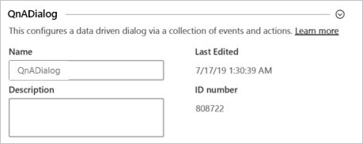
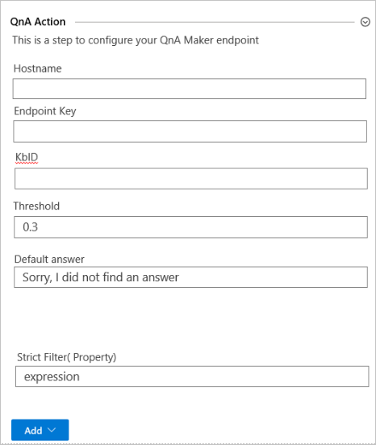

# Add QnA Maker integration 

## QnA Maker setup before using Composer

## Integrate on the Composer canvas

1. On the Composer canvas, select the **+** to see the list of available action event.
1. Select **Integrations** then select **QnA Maker**. 
1. On the QnA Maker integration panel, enter the following settings:

    

    | QnA Maker setting|Purpose|
    |--|--|
    |Name|Knowledge base name. |
    |Description|Knowledge base description.|
    
1. In the next section, enter the QnA Maker resource and knowledge base settings. 

    

    | QnA Maker setting|Purpose|
    |--|--|
    |Hostname||
    |Endpoint Key||
    |Knowledge base ID||
    |Threshold||
    |Default answer||
    |String Filter||

1. Select **Add** to add the dialog action for QnA Maker. 
