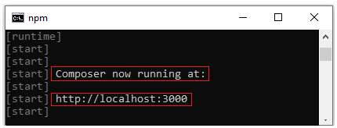

# Set up Bot Framework Composer using Yarn

Bot Framework Composer is designed to be a hosted web app. Currently, you need to run Composer locally as a web app and can do so using Yarn. 

<!---To set up and install Composer with docker you can read more [here](link to docker setup).-->

## Prerequisites

- [Node.js](https://nodejs.org/dist/v12.13.0/): version 12.13.0
- [Yarn](https://yarnpkg.com/en/docs/install): latest stable version
- [Bot Framework Emulator](https://github.com/microsoft/BotFramework-Emulator/releases/latest): latest stable version
- [.NET Core SDK 3.1](https://dotnet.microsoft.com/download/dotnet-core/current): required to test your bot

## Installation instructions
1. To start, open a terminal and clone the Composer GitHub repository. You will use this terminal for the rest of the steps in this section.

    ```
    git clone https://github.com/microsoft/BotFramework-Composer.git
    ```

2. After cloning the repository, navigate to the **Bot Framework Composer** folder.

    ```
    cd BotFramework-Composer
    ```

3. Run the following commands to navigate to the **Composer** folder and get all required packages:

    ```
    cd Composer
    yarn 
    ```

4. Next, run the following command to build the Composer application, this command can take several minutes to finish:

    ```
    yarn build 
    ```
  
   > [!NOTE]
   > If you are having trouble installing or building Composer run `yarn tableflip`. This will remove all of the Composer application's dependencies (node_modules) and then it reinstalls and rebuilds all of its dependencies. Once completed, run `yarn install` and `yarn build` again. This process generally takes 5-10 minutes.

5. Again using Yarn, start the Composer authoring application and the bot runtime:

    ```
    yarn startall
    ```

6. Once you see **Composer now running at:** appear in your terminal, you can run Composer in your browser using the address http://localhost:3000.

    

Keep the terminal open as long as you plan to work with the Composer. If you close it, Composer will stop running. 

The next time you need to run the Composer, all you will need is to run `yarn startall` from the **Composer** directory.

## Next steps

- Create a [echo bot](./quickstart-create-bot.md) using Composer.
