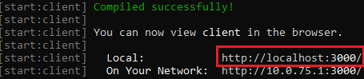

# Set up Bot Framework Composer using Yarn

The Bot Framework Composer is designed to be a hosted web app. Currently, you need to run the Composer locally as a web app and can do so using Yarn. To set up and install Composer with docker you can read more [here](link to docker setup). 

## Prerequisites

- [Node.js](https://nodejs.org/dist/v12.13.0/): version 12.13.0
- [Yarn](https://yarnpkg.com/en/docs/install): latest stable version
- [Bot Framework Emulator](https://github.com/microsoft/BotFramework-Emulator/releases/latest): latest stable version
- [.NET Core SDK 2.2](https://dotnet.microsoft.com/download/dotnet-core/2.2)

## Set up yarn for Composer
To start, clone the Composer GitHub repository. 
```
git clone https://github.com/microsoft/BotFramework-Composer.git
```

After cloning the repo open a terminal and navigate to the Bot Framework Composer folder. In the repo, navigate to the **Composer** folder. Run the following commands:
```
yarn install
```
  This command gets all dependent packages.

```
yarn build
```
  This command builds the Composer app. The build process can take few minutes.

```
yarn startall
```
  This command starts the Composer authoring application and the CSharp Bot runtime. 

## Open Composer in a browser
To use Composer open a browser and navigate to the address after the message `Compiled successfully`, as seen below where the address is https://localhost:3000.


