# Testing & Debugging

This document will explain different techniques you can use to test & debug your bot built using Bot Framework Composer.

**Pre-requisites:**

[Bot Framework Emulator](https://github.com/microsoft/BotFramework-Emulator/releases/tag/v4.5.2)
[Bot Framework Composer](https://github.com/Microsoft/BotFramework-Composer#installing-bot-framework-composer)
[ngrok](https://ngrok.com/)

To get started, load up a bot from the list of bots via the open dialog in the homepage.

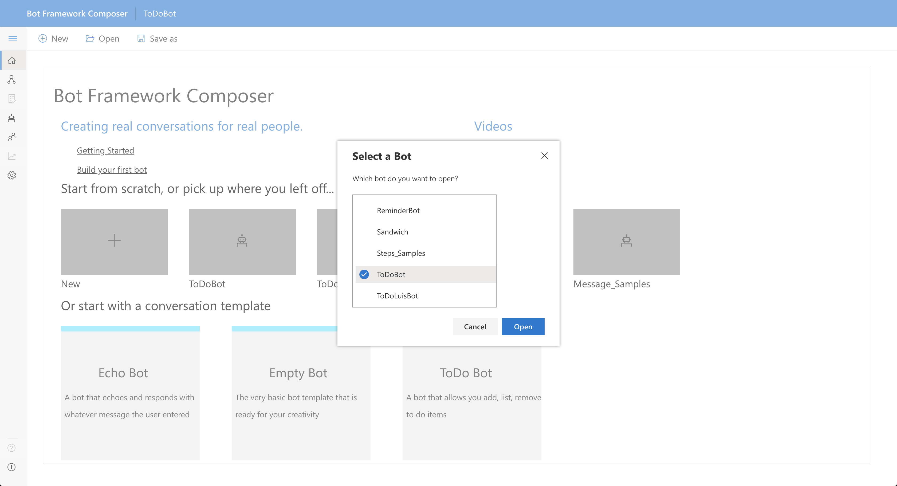

Open success, the application will navigate to the Design Flow page with your bot's entry dialog rendered visually for you to inspect and edit.

You can immediate start the sample bot by clicking the Start Bot button in the top-right of the application window. Give it a try:

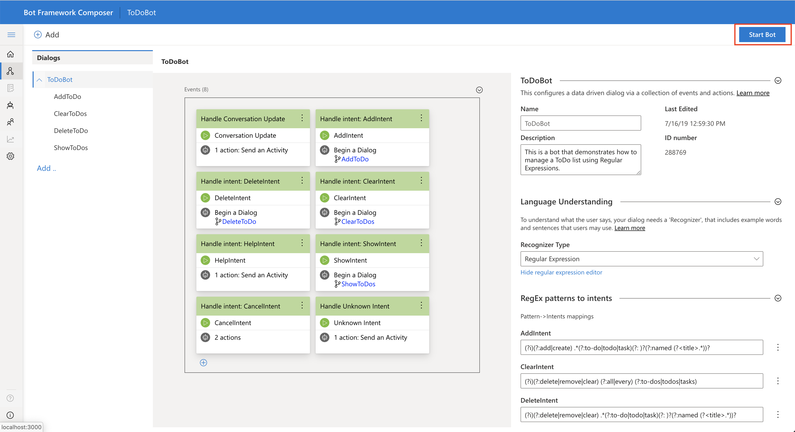

After a brief loading period, you'll see a new icon "Test in Emulator", clicking it will launch a browser dialog to start your local installation of the Bot Framework Emulator and connect to the bot that you just started in the previous step.

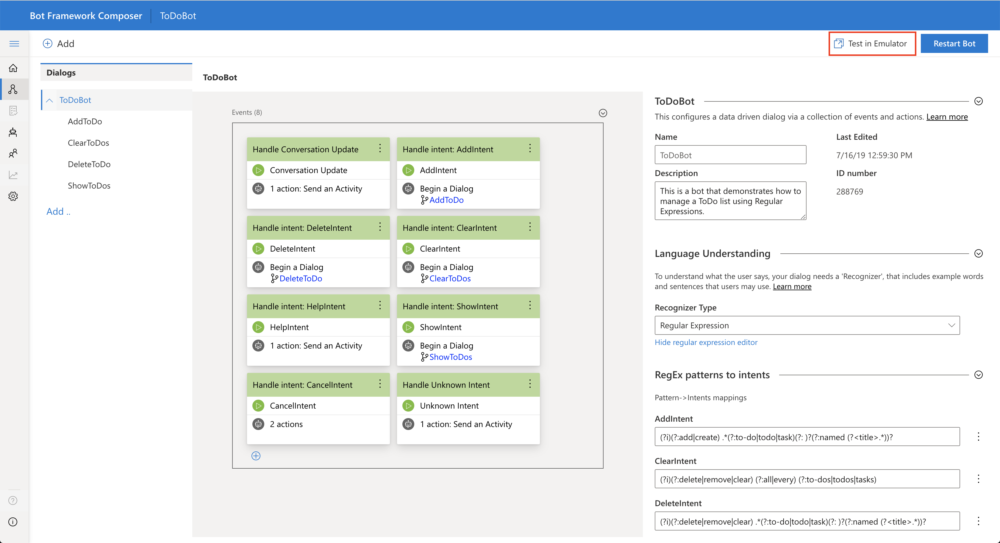

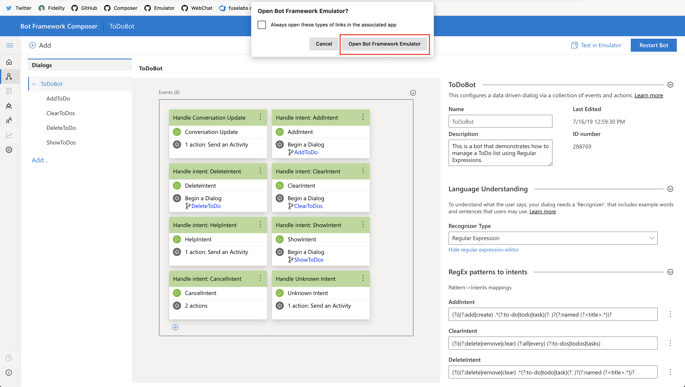
Selecting _"Always open these types of links in the associated app"_ will skip this confirmation dialog the next time you open the Emulator from BF Composer.

The Bot Framework Emulator will open and will immediately connect to your bot. You can interact with the bot in the chat window emphasized below:

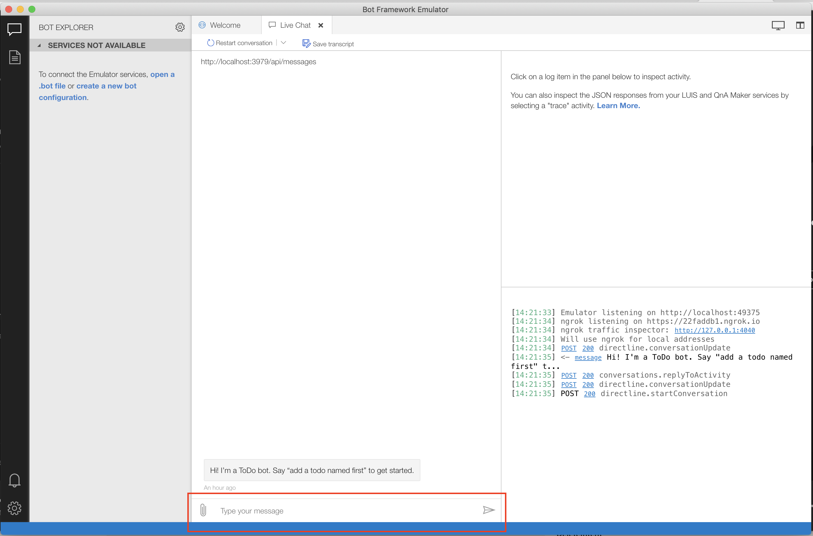

### Making changes to the Bot and testing those changes:

In BF Composer you can modify Dialogs, Events, Actions, Language Understanding, Language Generation and restart the conversation with the Bot that includes these changes. Once you want to test changes you've made to your Bot, click the "Restart Bot" button in the top-right edge of the application panel.

Restarting the bot can potentially do a few things:

1. It will do some validation on the changes made and surface errors to you if it senses them. The different validations being executed are being actively worked on and expanded.
2. If you make changes to a Dialog with a BF Language Understanding (LUIS) recognition type - the data will be pushed to the LUIS service and models will be generated/updated. If you haven't yet provided your LUIS credentials to Composer, you will be prompted to provide them during this step.

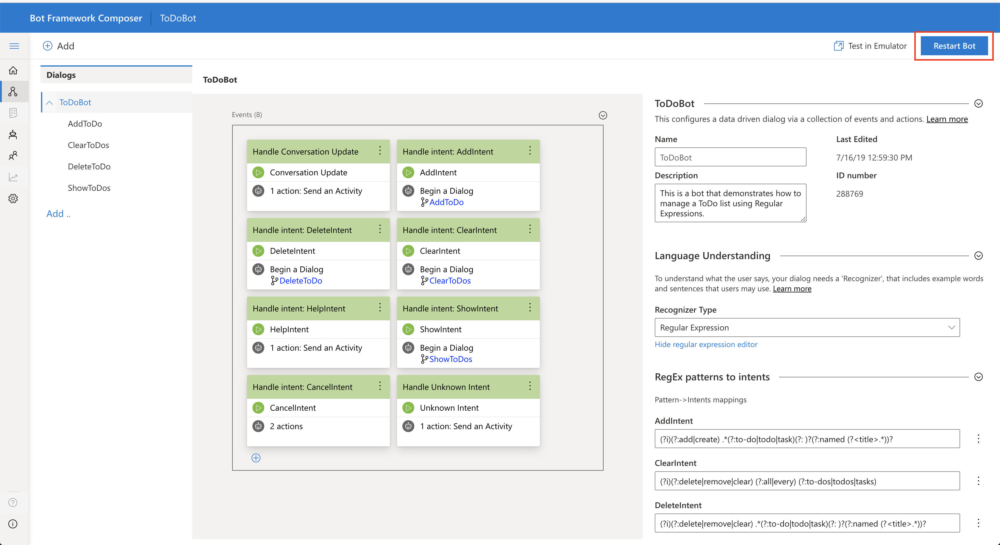

Restarting the bot can potentially do a few things:

1. It will do some validation on the changes made and surface errors to you if it senses them. The different validations being executed are being actively worked on and expanded.
2. If you make changes to a Dialog with a BF Language Understanding (LUIS) recognition type - the data will be pushed to the LUIS service and models will be generated/updated. If you haven't yet provided your LUIS credentials to Composer, you will be prompted to provide them during this step.

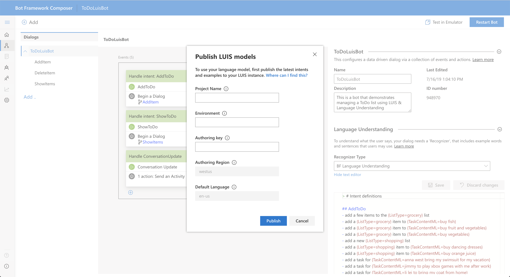

From there you can navigate back to the Bot Framework Emulator application and click the _"Restart conversation"_ button at the top of the conversation control, or click the _"Test in Emulator"_ button directly in BF Composer.

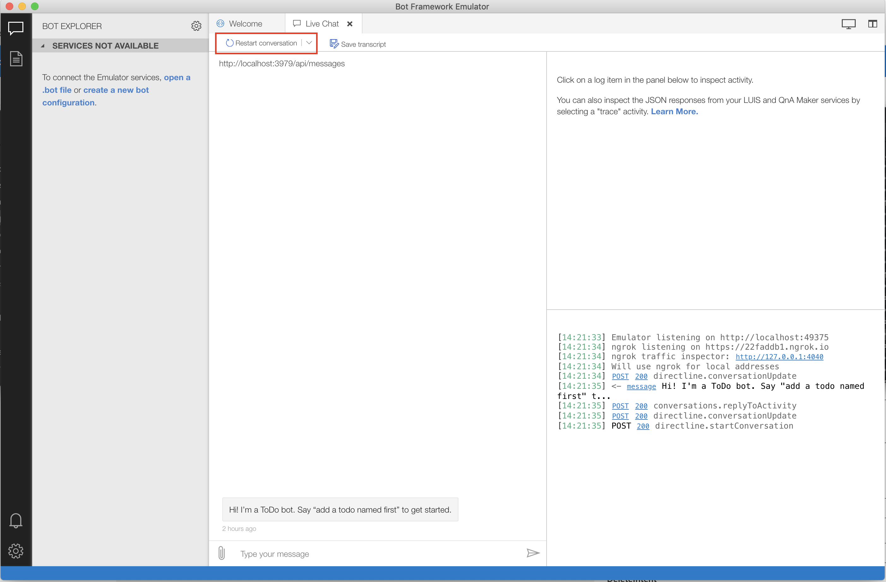

Run through these steps each time you want to test changes made to your bot.

**A note on connecting to a bot using the OAuth prompt:**

In a scenario where you would like to test a bot with the OAuth prompt capabilities, you need to provide a `MicrosoftAppId` & `MicrosoftAppPassword` in BF Composer's settings page below:

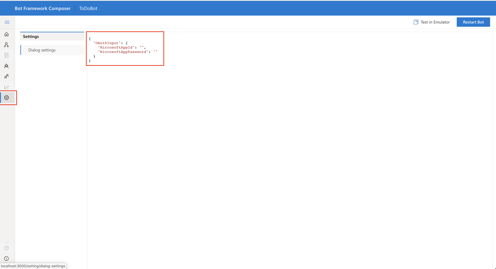

Providing these credentials in this page means that when you connect to your bot using the _"Test in Emulator"_ button, the `MicrosoftAppId` & `MicrosoftAppPassword` provided will also be used when connecting.

### Troubleshooting

Different error types that you may see when you are building your bot:

##### Validation errors

_Saving LU data_

When you configure BF Language Understanding as a recognizer type in a dialog, you see an editor like below:
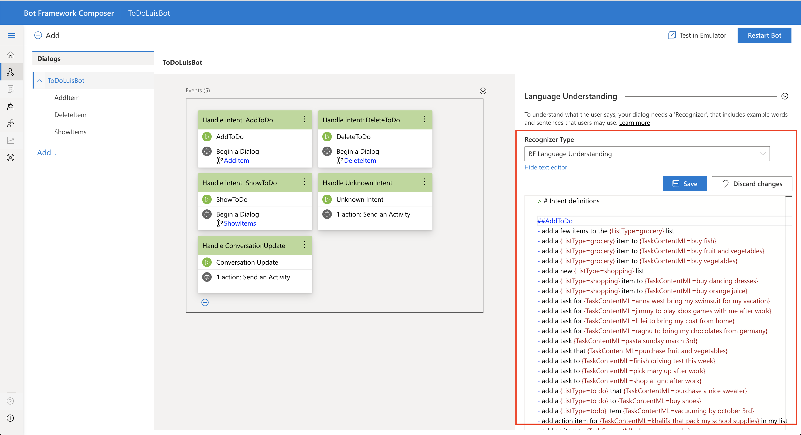

Attempting to save changes that do not match the LU file format results in an error like below:

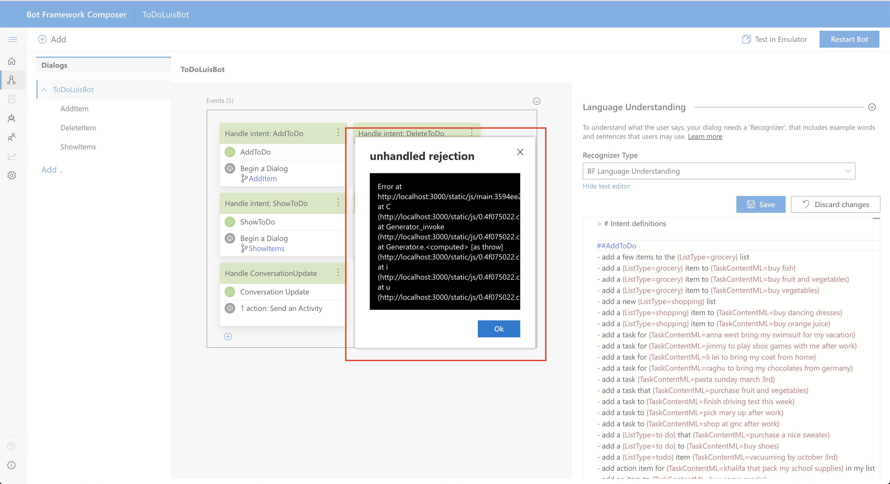

Seeing this error means that you have badly formatted lu data. Refer to the [LU file format](https://github.com/microsoft/botbuilder-tools/blob/master/packages/Ludown/docs/lu-file-format.md) for troubleshooting.

_Saving LG data_

When you are using the _Send an Activity_ action, the Language Generation syntax is required. If there is malformed syntax you will see the following:

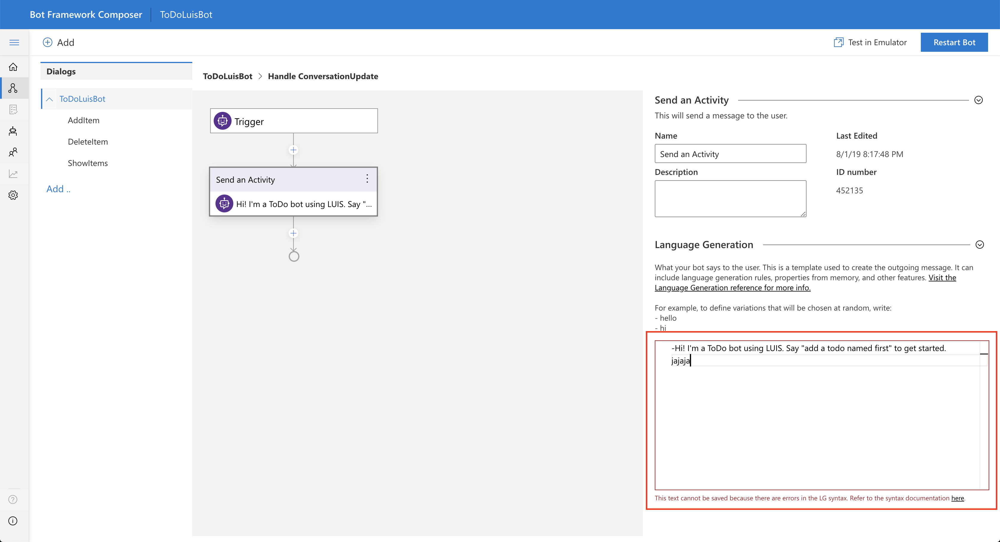

Refer to the [LG syntax](https://github.com/microsoft/BotBuilder-Samples/blob/master/experimental/language-generation/docs/lg-file-format.md) for troubleshooting.

##### Error publishing to LUIS

If you have incorrect credentials used to publish updating data to the LUIS service, you will see the following error:

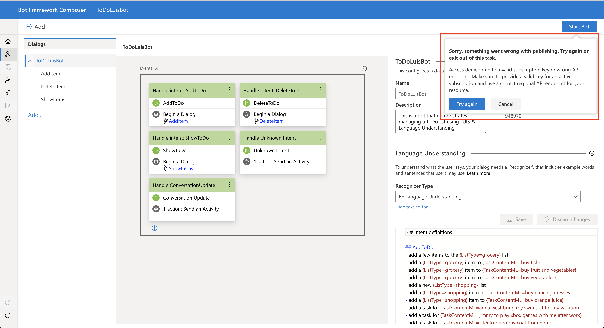

Address your credential issues by clearing your web browsers local storage cache. This is often achieved by selecting _File -> Clear Browsing Data_. Hitting _Start/Restart Bot_ once more will allow you to provide new credentials.

##### Errors during the conversation

_Connection errors to the bot_

Make sure that if your bot is configured to use a `MicrosoftAppId` & `MicrosoftAppPassword` that you are providing values for these fields in the BF Composer _Settings_ page.

_BF Emulator's tunneling software (ngrok) has expired_

The BF Emulator has a dependency on the [ngrok](https://ngrok.com/) tunneling software. This tunnel will expire and the BF Emulator will need to reconnect to the tunnel to be able to connect to your running bot. In this scenario you should see a red notification in the bottom-right corner of the BF Emulator that when clicked will open up the notifications panel. A message those be there with the option to reconnect to ngrok.

###### During testing of your bot, you may see the following in the chat control:

_Object reference not set to an instance of an object_

This usually happens when there is an error in the Language Generation template being referenced in a dialog.

_Value cannot be null. Parameter name: activity_

This happens when a dialog has an empty or incomplete action in its flow. For example, _Send an Activity_ actions cannot be empty if part of a dialog's flow.
