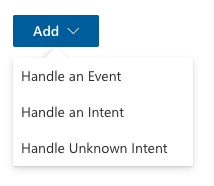
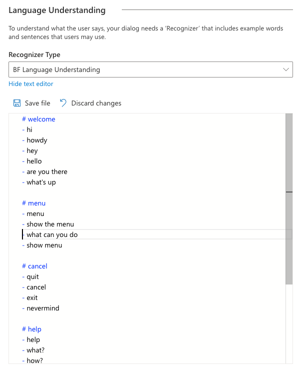
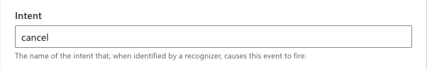

# Events and Triggers

As discussed earlier, [each dialog includes a set of event handlers](introduction_to_bfd.md#building-blocks) that contain instructions for how the bot will respond to messages (and other inputs) received while the dialog is active.

The basic form of an event handler is "When (EVENT) happens, then do (ACTIONS)".  The triggering event can be one of several types of event, while the actions are one or more programmatic steps the bot will take to fulfill the user's request.

Any time a bot receives a message, an event of type `activityReceived` is fired. Then, as the message is processed by the recognizer and passed through the dialog system, other events of different types are fired. If an event handler is found to handle an incoming event, that event is considered handled, and processing of further event handlers stops. If no event handler is found, the event will pass through the bot with no additional actions taken.

## Anatomy of an Event Handler

TODO:
TRIGGER + ACTIONS


## Types of Event Handlers

There are several types of event handlers available within Composer. They all work in a similar manner, and in some cases, can be interchanged.



The base type of event handler, labeled "Handle an Event" in the menu, allows a bot to handle events based on their type. For example, most dialogs will include an event handler configured to respond to the `BeginDialog` event, which fires when the dialog begins and allows the bot to respond immediately.

Use event handlers when you want to do things like:

* Take actions immediately when the dialog starts, even before the recognizer is called
* Take actions when a "cancel" signal is detected
* Take automatic action on every message as it is received or sent
* Evaluate the raw content of the incoming activity

There are two other types of event handler that have been slightly specialized to work with the Recognizers. After the first round of events is fired, the bot will pass the incoming activity through the configured Recognizer.  There can be two possible outcomes from this: the recognizer detects a named intent, or the recognizer does _not_ detect an intent. [More about Recognizers below.](#defining-triggers-with-recognizers)

When a recognizer detects an intent, the bot looks for an intent handler configured to handle the extracted intent. If found, the matching handler actions are found, and processing ends. When using recognizers, most of the functionality in your bot will be triggered by intent handlers.

Use intent handlers when you want to do things like:

* Trigger major features of your bot using natural language
* Recognize common interuptions like "help" or "cancel" and provide context-specific responses
* Extract and use entity values as parameters to your dialog or a child dialog

Finally, if an intent is _not_ detected by the recognizer, any configured "Unknown Intent" handlers will fire. This will only fire if no matching intent handler or event handler is found.

## Defining Triggers with Recognizers

Bot Framework Composer is deeply integrated with the [LUIS.ai](https://www.luis.ai) language understanding API. LUIS is able to take natural language input from users and translate it into a named intent and a set of extracted entity values.

From within the dialog editing interface, developers can create a training data that gives LUIS the ability to recognize the specific set of intents and entities required by the bot. Composer uses a Markdown-like syntax called "ludown" to manage this content.

In the screenshot below is shown a bot with 4 intents defined: welcome, menu, cancel and help. Intents are defined using the syntax `# [INTENT NAME]`.

Below each intent is a series of sample utterances which are used as training data to teach LUIS how to recognize the intent.  Provide as many sample utterances as you can!  Sample utterances are defined using the syntax:

```
- [Example Utterance 1]
- [Example Utterance 2]
- [Example Utterance 3]
```



Note that language models take some tuning to get just right, so you may need to iterate on the design of your intents and the example utterances used to get the best results.

Once intents have been defined in the Language Understanding configuration of a dialog, it is possible to define `Intent Handlers` for each intent. Within the intent handler's definition, specify the _exact name_ of the intent you wish to handle:



In addition to specifying intents and utterances, it is also possible to train LUIS to recognize named entities and patterns.  [Read more about the full capabilities of LUIS recognizers here](https://github.com/microsoft/botbuilder-tools/blob/master/packages/Ludown/docs/lu-file-format.md)

Extracted entities are passed along to any triggered actions or child dialogs using the syntax memory path `@[Entity Name]`.   For example, given an intent definition like below:

```
# book-flight
- book a flight to {city=austin}
- travel to {city=new york}
- i want to go to {city=los angeles}
```

When triggered, if LUIS is able to identify a city, the city name will be made available as `@city` within the triggered actions. The entity value can be used directly in expressions and LG templates, or [stored into a memory property](using_memory.md) for later use.

### Regular Expression Recognizer

Composer also provides a recognizer that uses regular expressions rather than the LUIS API.

Regular expressions are rigid patterns that can be used to match simple or sophisticated patterns in text.  Composer exposes the ability to define intents via regular expressions, and also allows the regular expressions to extract simple entity values.

Regular expressions are great if you need to match a narrow set of highly structured commands or keywords, however do not have the flexibility of a more fully featured language understanding technology like LUIS.

## Event Bubbling

## Common Event Handler Recipes

* Take action immediately when a dialog begins: in leaf dialogs: `beginDialog`
* Send a welcome message as soon as the user begins chat: in Root dialog only: `activityReceived` with condition `(turn.activity.type=='conversationUpdate' && turn.activity.membersAdded[0].name != 'Bot')`

## Further Reading

* [LU file format](https://github.com/microsoft/botbuilder-tools/blob/master/packages/Ludown/docs/lu-file-format.md)
* [LUIS.ai docs]()
* [Adaptive Dialog Events](https://github.com/microsoft/BotBuilder-Samples/blob/master/experimental/adaptive-dialog/docs/recognizers-rules-steps-reference.md#Rules)
* Messaging processing pipeline in adaptive dialogs

## Next

