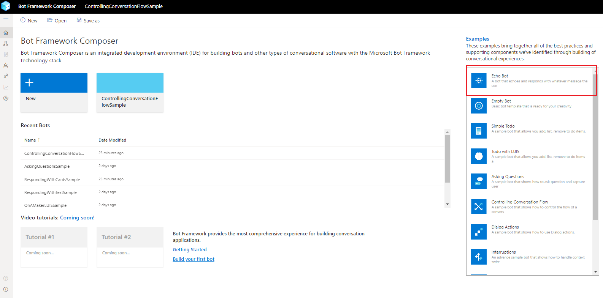

# Create an echo bot using the Bot Framework Composer
In this quickstart you will learn how to create an echo bot using the Bot Framework Composer **Echo Bot** template, and test it in the Emulator.

## Prerequisites
All of the prerequisites for creating an echo bot are included in [Set up the Bot Framework Composer with Yarn](./setup-yarn.md).

## Creating an echo bot
1. Follow the instructions in [Set up the Bot Framework Composer with Yarn](./setup-yarn.md) to get Composer running. 
After opening Composer in a browser click the **Echo Bot** button at the top of the Examples list on the homepage.

    

2. The **Define conversation objective** form:
    1. Enter the name for your bot in the **Name**, or keep the default name `EchoBot-0`.
    2. Enter "_This is a simple Echo bot. It echoes the user input back to them._" in the **Description** field. 
    3. Select the location to save your bot.
    4. Save your changes and create your echo bot by selecting **Next**.

        

3. You will now see your bot's main dialog. In the _properties panel_ on the right side of the Composer screen you will notice that the **Recognizer Type** is set to **None** by default. Since this is a simple echo bot you don't need to use any [recognizers](./concept-events-and-triggers-draft.md#regular-expression-recognizer#regular-expression-recognizer) or [LUIS models](https://aka.ms/what-is-luis), so leave it set to none.

    

4. You can now test your bot in the Bot Framework Emulator by selecting **Start Bot** in the top right side of the Composer screen then **Test in Emulator**.

    

5. Anything you type in the Emulator should be echoed back to you.

    

You've successfully created an echo bot!  

## Next Steps
Create a [weather bot](tutorial/bot-tutorial-introduction.md) using Composer.
