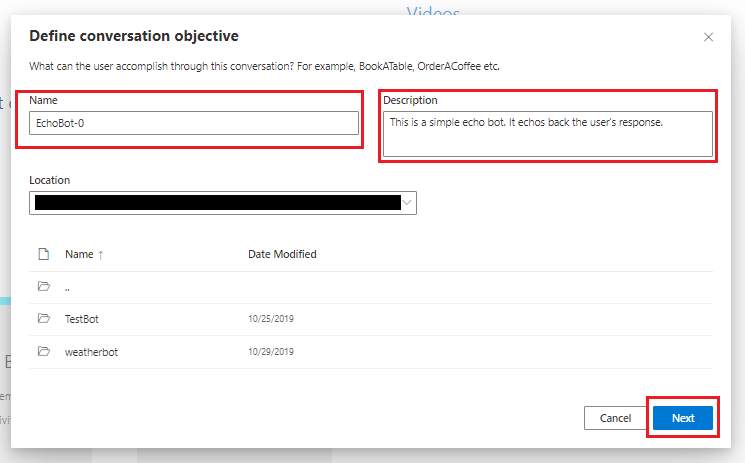
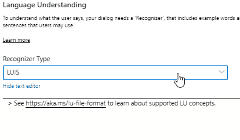

# Create an echo bot using Bot Framework Composer
This tutorial will walk you through how to create a simple echo bot using the Bot Framework Composer **Echo Bot** template and then test it.

## Prerequisites
All of the prerequisites for creating an echo bot are included in [setup Composer with Yarn](https://github.com/microsoft/BotFramework-Composer/blob/kaiqb/Ignite2019/docs/setup-yarn.md).

## Creating an echo bot
1. Follow the instructions in [setup Composer with Yarn](https://github.com/microsoft/BotFramework-Composer/blob/kaiqb/Ignite2019/docs/setup-yarn.md) to get Composer running. 
After opening in a browser click the **New** button at the top of the homepage.

2. Click **Create from template** and select **Echo Bot** as seen below

3. Fill in the **Name** with`EchoBot` and copy `This is a simple echo bot. It echos back the user's response.` to the **Description** box. Choose where you want to save the bot and click **Next**.

4. You know will see your bot's main dialog. On the right in the Property panel click the dropdown under **Recognizer Type** and select `None`. Since this is a simple echo bot you don't need to use any recognizers or LUIS models.

5. You're now ready to start and test your bot. Click **Start Bot** in the top right. You will then see the **Test in Emulator** button show up. Click that and Bot Framework Emulator should start.

7. Type anything in the Emulator to have the bot echo back your response.

You've successfully created an echo bot!  

## Next Steps
Create a [weather bot](https://github.com/vishwacsena/composer-managed-lab) using Composer.

