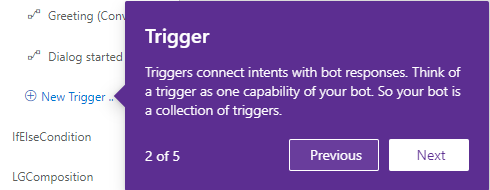

# Onboarding 

The Bot Framework Composer provides `Onboarding` functionality to help you get familiar with the bot creation process. This functionality consists of a _product tour_ that includes five sections with each section containing one or more tips.

1. To run the Composer _product tour_:

    1. Select **Settings** (the cog-shaped icon), in the menu on the left side of the Composer screen.
    2. Once in the **Settings** screen, select **Onboarding** in the navigation pane.
    3. Once in the _Onboarding_ screen, Toggle the **Onboarding** switch to **Enabled**.

        

    The Onboarding feature is now enabled. You can now start the _product tour_.

2. To start the product tour, select the **Design button** on the menu.

    

    > [!TIP]
    > Optionally you can start the product tour by selecting the **Home** button:
    >
    > 

3. You will see the _Onboarding_ **Welcome!** screen appear at the bottom right corner of the screen. The Onboarding tour consists of five sections. Each section consists of one or more tips. Select **Learn the basics** and you will start your Onboarding tour. 

    

4. You can navigate backwards or forward through the tips of a section by using the **Previous** or **Next** buttons. 

    

    > [!TIP]
    > You can exit the tour at anytime by simply selecting anywhere outside the overview views. If you do, you will see a popup window asking if you would like to **Leave Product Tour**. If you select **Yes** your onboarding process will end. If you select **Cancel** your onboarding process resumes. 
    >
    > 

5. Once you complete a section, select done and you will return to the the _Onboarding_ **Welcome!** screen where you can continue to the next section of the tour.

    

    > [!NOTE]
    > Sections that only contain a single tip will not have the **Previous**, **Next** or **Done** buttons but instead you can select the **Got it!** button to move to the next section. Once you complete a section, you cannot go back to it without restarting the onboarding tour.

6. Once you complete the tour, select **Done!**. The **Onboarding** switch in your settings will automatically be set to **Disabled**.

You can restart the onboarding tour anytime by repeating these steps.

## Next 
- Learn [how to build a weather bot](./tutorial/bot-tutorial-introduction.md). 

