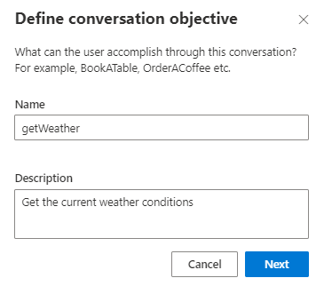
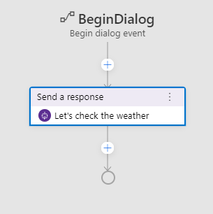
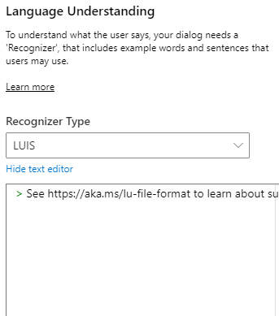
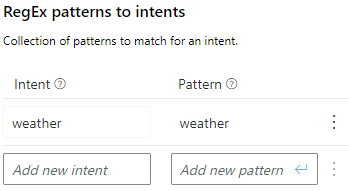
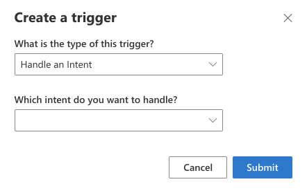
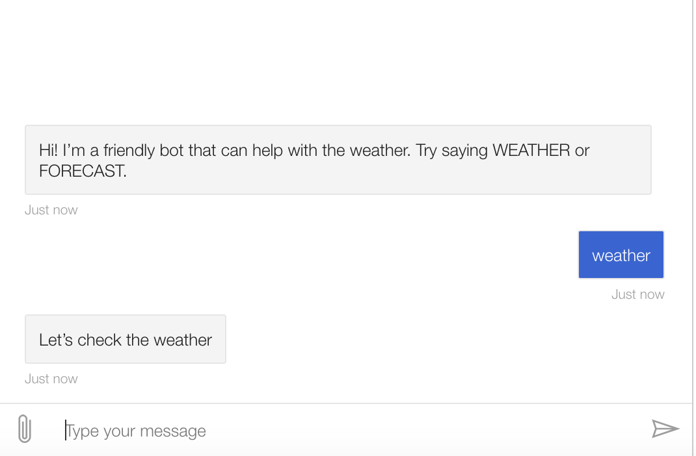

# Add a dialog

When building features of a bot with Composer, it is sometimes useful to create a new `dialog` to contain a chunk of functionality. This helps keep the dialog system organized, and also allows sub-dialogs to be combined into larger, more complex dialogs. 

Remember - each dialog contains one or more triggers that launch associated actions. They can have their own dedicated language model. Dialogs can call other dialogs and can pass values back and forth.

## What are we building?

The main feature of this bot is reporting on the current weather conditions.

To do this, we'll create a dialog that 
- prompts user to enter a zipcode (to use as location for weather lookup)
- calls an external API to retrieve the weather data for a specific zipcode.

First, we'll set up all the components and make sure they work together. Then, we'll flesh out the functionality.

## Create a new dialog

1. Click the `+ New Dialog` button in the left hand explorer. A dialog will appear and ask for a `name` and `description`
2. Give this new dialog the name:
    
      `getWeather`
    
    and the description:
    
      `Get the current weather conditions`

3. Click `Next`, and Composer will create the new dialog and open it in the editor.  

   

Composer created this new dialog with a `BeginDialog` trigger pre-configured.

3. For now, we'll just add a simple message to get things hooked up, then we'll come back to flesh out the feature. With `BeginDialog` trigger selected, click the "+" in the flow, and use the same `Send a response` action.  Set the text of the activity to:
   
      `Let's check the weather`

   You'll have a flow that looks like this:

   

## Wiring up dialogs
You can break pieces of your conversation flow into `dialogs` and can chain them together. Let's get the newly created `getWeather` dialog wired up to the root dialog.

1. Click on `WeatherBot.Main` from the left navigation tree. After selecting `weatherBot.Main` from the explorer, find the `Language Understanding` section of the property editor. 

   > Each dialog can have it's own `recognizer`, a component that lets the bot examine an incoming message and decide what it means by choosing between a set of predefined `intents`. Different types of recognizers use different techniques to determine which intent, if any, to choose.

   > For now, we're going to use the `Regular Expression` recognizer, which uses pattern matching. Later, we'll use more sophisticated natural language understanding technology from `LUIS`.

2. Under the `Recognizer Type`, select `Regular Expression`

   

3.  Click the `Add` button. 2 new fields will appear: one labeled `intent` and one labeled `pattern`

   

4. Define the bot's first intent. Set the value of the `intent` field to:

      `weather`

5. Set the value of the `pattern` field to:

      `weather`

   > This tells the bot to look for the word "weather" anywhere in an incoming message. Regular expression patterns can be much more complicated than this, but for now, this will do!

6. Click "+ New Trigger" in the left hand side under the `weatherBot.Main` header, and a modal will appear. Select `handle an intent` from the first dropdown, and then select our freshly created `weather` intent from the second dropdown.

   

7. Click the "+" in the flow and select the `Dialog management` option. From the submenu, select `Begin a new dialog`

8. In the property editor for the new action, set the `dialog name` property to  our `getWeather` dialog.

## Let's test it out.

1. Click the `Restart Bot` button in the upper right hand corner of the Composer window.  This will update the bot runtime app with all the new content and settings. Then, click `Test in Emulator`. When Emulator connects to your bot, it'll send the greeting we configured in the last section.

   

2. Send the bot a message that says `weather`. The bot should respond with our test message, confirming that our intent was recognized as expected, and the fulfillment action was triggered.

   

## Next steps
- [Get weather](./bot-tutorial-get-weather.md)
