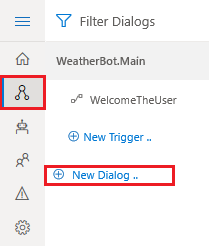
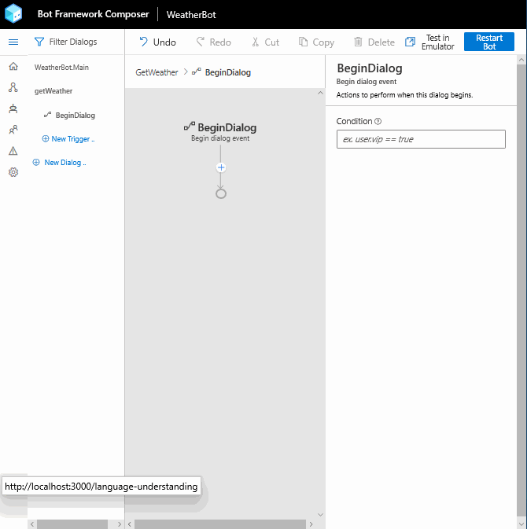

# Tutorial: Adding dialogs to your bot

This tutorial walks you through adding additional dialogs to a basic bot with the Bot Framework Composer and testing it in the Emulator. 

In this tutorial, you learn how to:

> [!div class="checklist"]
> * Build on the basic bot created in the previous tutorial using the Bot Framework Composer by adding an additional dialog
> * Learn how to call external API
> * Run and interact with your bot locally using the Bot Framework Emulator

## Prerequisites
- The [Bot Framework Composer](../setup-yarn.md)
- The [Bot Framework Emulator](https://aka.ms/bot-framework-emulator-readme)
- Completion of the tutorial [Create a new bot and test it in the Emulator](./bot-tutorial-create-bot.md)
- An understanding of the concepts taught in [the dialog concept article](../concept-dialog.md)

# Adding dialogs

It can be useful to organize functionality in [**dialogs**](../concept-dialog.md) when building the features of your bot with Composer. This helps keep things organized and also allows sub-dialogs to be combined together into larger more complex dialogs. 

A dialog contains one or more [Triggers](../concept-events-and-triggers.md) and each trigger consists of one or more actions which are the set of instructions that the bot will execute. Dialogs can also call other dialogs and can pass values back and forth between them.

## What are you building?

The main feature of this bot is reporting on the current weather conditions.

To do this, you will create a dialog that 
- Prompts the user to enter a zip code to use as location for weather lookup.
- Calls an external API to retrieve the weather data for a specific zip code.

> [!TIP]
> It is recommended that you first create all of the components of your bot and make sure they work together before creating the detailed functionality.

## Create a new dialog
1. Go to the Composers _Design_ page by selecting the _Design icon_ from the Menu on the upper left side of the Composer screen.

2. Select **+ New Dialog** in the Navigation pane. 

   

3. The _Define conversation objective_ form will appear and ask for a **Name** and **Description** for the new dialog. 

      **Name**: "*getWeather*"
    
      **Description**: "*Get the current weather conditions*"

4. Select **Next**. Composer will create the new dialog and open it in the editor. 

   

> [!NOTE]
> Composer creates the new dialog with a `BeginDialog` trigger.

5. For now, just add a simple message to get things hooked up, then come back to flesh out the feature. With the `BeginDialog` trigger selected, select the **+** in the flow, and use the same **Send a response** action. Set the text of the activity to:
   
      `Let's check the weather`

   You'll have a flow that looks like this:

   

## Connect your new dialog
You can break pieces of your conversation flow into different dialogs and can chain them together. Next you need to get the newly created `getWeather` dialog connected to the main dialog.

1. Select **WeatherBot.Main** in the _Navigation_ panel. 

2. find the **Language Understanding** section of the in the _Properties_ panel

   > Each dialog can have it's own [recognizer](../concept-dialog.md#recognizer), a component that lets the bot examine an incoming message and decide what it means by choosing between a set of predefined [intents](../concept-language-understanding.md#intents). Different types of recognizers use different techniques to determine which intent, if any, to choose.

   > [!NOTE]
   > For now, you're going to use the [Regular Expression Recognizer](../how-to-define-triggers.md#regular-expression-recognizer), which uses pattern matching. Later, you will use more sophisticated natural language understanding technology from [LUIS](../how-to-define-triggers.md#luis-recognizer).

3. Select **Regular Expression** from the **Recognizer Type** drop-down list. 

4.  Enter "*weather*" for both **Intent** and **Pattern**

      > [!NOTE]
      > This tells the bot to look for the word "weather" anywhere in an incoming message. Regular expression patterns are generally much more complicated, but this is adequate for the purposes of this example.

5. Next, create a new trigger in the **weatherBot.Main** dialog by Selecting "+ New Trigger".

6. In the **Create a trigger** form that appears, select _Intent recognized_ as the trigger type, then select "_weather_" from the **Which intent do you want to handle?** drop-down list, then **Submit**.

7. Next, create a new action for the _Intent recognized_ trigger you just created. You can do this by selecting the **+** in the _Authoring canvas_, then select **Begin a new dialog** from the **Dialog management** menu.
   
8. In the _Properties_ panel for the new **Begin a new dialog** action, select _getWeather_ from the **dialog name** drop-down list.

   

Now when a user enters "_weather_", you bot will respond by activating the _getWeather_ dialog. In the next tutorial you will learn how to prompt the user for additional information, then query a weather service and return the results to the user, but first you need to validate that the functionality developed so far works correctly, you will do this using the Emulator.

## Testing your bot.

1. Select the **Restart Bot** button in the upper right hand corner of the Composer window. This will update the bot runtime app with all the new content and settings. Then select **Test in Emulator**. When the Emulator connects to your bot, it'll send the greeting you configured in the last section.

   

2. Send the bot a message that says `weather`. The bot should respond with your test message, confirming that your intent was recognized as expected, and the fulfillment action was triggered.

   
   
## Next steps
- [Get weather](./bot-tutorial-get-weather.md)
