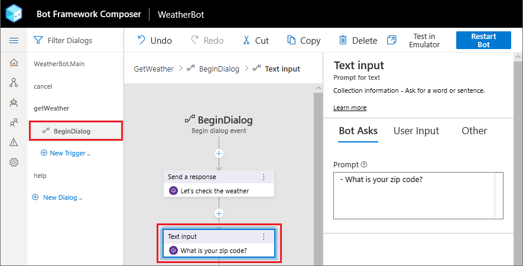

# Using cards

You can use the language generation system to also render UI cards and button actions to user. 

Let's further refine the responses provided by the weather bot to include cards and button actions. 

## Rendering suggested actions

Suggested actions help guide user by providing them most frequently used set of actions to interact with the bot. 

First, let's go ahead and update `prompt for zipcode` to include suggested actions for help and cancel actions.

1. In Composer, click on `getWeather`, then make sure to highlight the `beginDialog` trigger.

   

2. Select the `What is your zipcode?` node in the flow.

   

3. Update the prompt text to be this instead - 
    ```
    [Activity
        Text = What is your zipcode?
        SuggestedActions = help | cancel
    ]
    ```

4. Click `Reload Bot` and open it in the emulator.

---

Now when you say weather to your bot, you will not only see that your bot asks you for zipcode but also presents help and cancel button as suggested actions.


---

Next up, let's change the weather report to also include a card.

5. With the `getWeather` dialog selected and `BeginDialog` trigger selected, scroll down to the bottom, and click on the `Send a response` node that starts with `{DescribeWeather(dialog.weather)}...`
6. Instead of coming back with simple text response, let's have this action come back with a weather card. Replace the activity with this - 
    ```
    [ThumbnailCard
        title = Weather for @{dialog.weather.city}
        text = The weather is {dialog.weather.weather} and @{dialog.weather.temp}&deg;
        image = @{dialog.weather.icon}
    ]
    ```

7. Click `Reload Bot` and open it in the emulator.

---

Go through the bot flow, say `weather` followed by a zip code. Notice now the bot responds back with a card and image.

   

---

## Next steps
- [Add LUIS](./bot-tutorial-luis.md)
