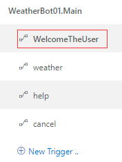
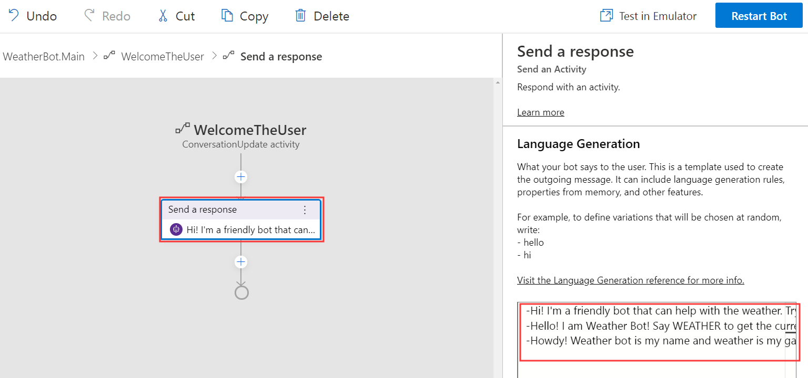
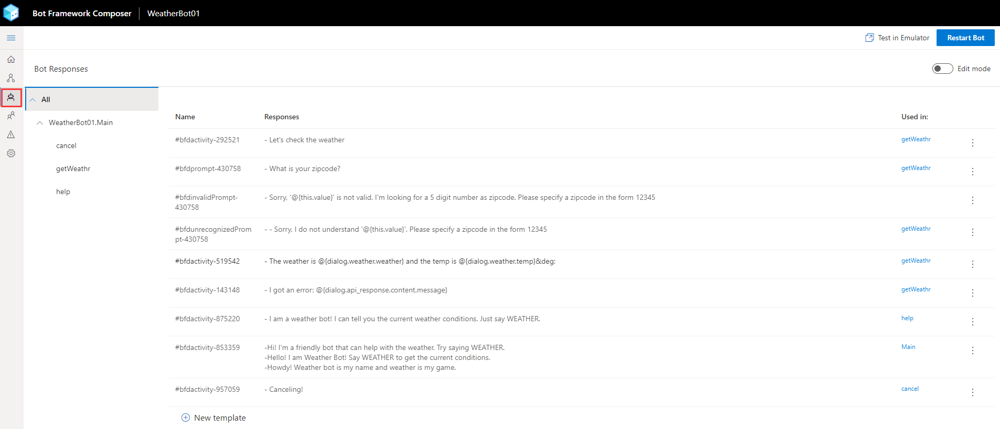
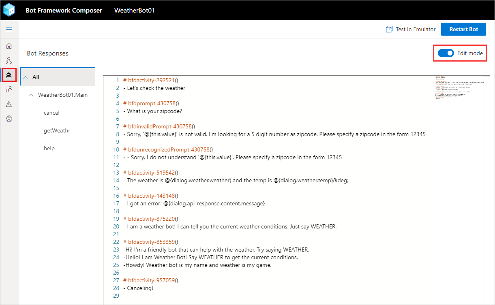
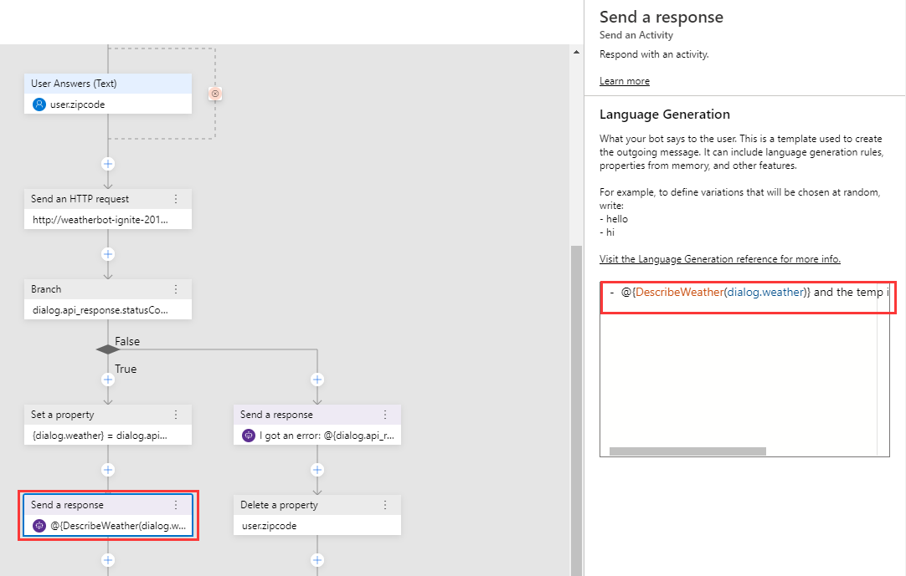
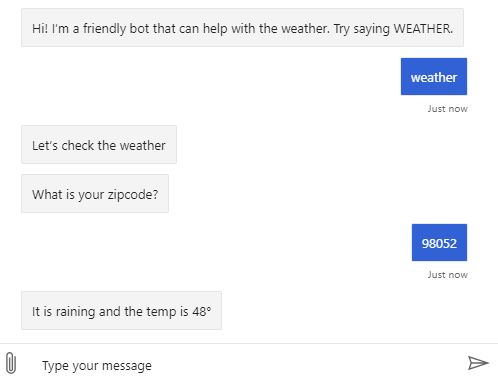

# Language generation

Now that the bot can perform its basic tasks, it's time to work on the conversational UI. A good bot doesn't just do a task - it does it with style and personality.

Composer includes the Bot Framework Language Generation library, a set of powerful templating and message formatting tools that make it easy to include variation, conditional messages, and dynamic content that puts you control of how your bot responds to the user!

Let's start by adding some variation to the welcome message.

1. In Composer, click on `weatherBot.Main`, then make sure to highlight the `WelcomeTheUser` trigger.

    

2. Select the `Send a response` node in the flow.

   

3. In the right hand property editor, replace the text with the following:

    ```
    -Hi! I'm a friendly bot that can help with the weather. Try saying WEATHER.
    -Hello! I am Weather Bot! Say WEATHER to get the current conditions.
    -Howdy! Weather bot is my name and weather is my game.
    ```

    > Each tick mark indicates a variation in the message. The bot will choose one of the responses randomly at runtime!

4. Click `Reload Bot` and open it in the emulator.

---

You'll see the bot greet you with one of the three variants we listed. 

Click the `Restart conversation` link in Emulator's top bar. You might see another variant! If you see the same response, click `Restart conversation` again! 

---

Currently, the bot reports the weather in a very robotic manner: The weather is Clouds and it is 75&deg;.

Let's improve the language used when delivering the weather conditions. To do this, we'll use 2 features of the language generation system: conditional messages, and parameterized messages.

5. Navigate to the `Bot Says` tab by clicking the bot icon on the far left of the screen.

   

6. Toggle the `Edit Mode` switch in the upper right hand corner so that it turns blue.  This will enable a syntax-highlighted LG editor in the main pane.

   > You'll notice that every message you created in the flow editor also appears here. They're linked, and any changes you make in this view will be reflected in the flow as well.

    

7. Scroll to the bottom of the editor.
8. Paste the following text:
    ```
    # DescribeWeather(weather)
    - IF: {weather.weather=="Clouds"}
        - It is cloudy
    - ELSEIF: {weather.weather=="Thunderstorm"}
        - There's a thunderstorm
    - ELSEIF: {weather.weather=="Drizzle"}
        - It is drizzling
    - ELSEIF: {weather.weather=="Rain"}
        - It is raining
    - ELSEIF: {weather.weather=="Snow"}
        - There's snow
    - ELSEIF: {weather.weather=="Clear"}
        - The skies are clear
    - ELSEIF: {weather.weather=="Mist"}
        - There's a mist in the air
    - ELSEIF: {weather.weather=="Smoke"}
        - There's smoke in the air
    - ELSEIF: {weather.weather=="Haze"}
        - There's a haze
    - ELSEIF: {weather.weather=="Dust"}
        - There's a dust in the air
    - ELSEIF: {weather.weather=="Fog"}
        - It's foggy
    - ELSEIF: {weather.weather=="Ash"}
        - There's ash in the air
    - ELSEIF: {weather.weather=="Squall"}
        - There's a squall
    - ELSEIF: {weather.weather=="Tornado"}
        - There's a tornado happening
    - ELSE:
        - {weather.weather}
    ```

    > This creates a new Language Generation template called `DescribeWeather`. This template receives weather data from our API as a parameter, and outputs a friendlier 
    description of the weather based on the raw data from the API.

9. Navigate back to the flow designer by clicking on `Flow designer` in the left navigation bar.
10. In Composer's explorer, click on the `getWeather` dialog, and make sure the `BeginDialog` trigger is highlighted.

      

11. Scroll to the bottom, and click on the `Send a response` node that starts with `The weather is...`
13. In the right hand property pane, replace the activity text with the following:

      `- {DescribeWeather(dialog.weather)} and the temp is {dialog.weather.temp}&deg;`

      > Here, we are using the `DescribeWeather` template _inside another template_. LG templates can be combined in this way to create more complex templates.

      

14. Click `Reload bot` and open it in the emulator.

---

Now, when you say `weather`, the bot will send you a message that sounds much more human than it did before!

It's possible to combine these techniques to quickly create lots of variety in your messages!



## Next steps
- [Use cards](./bot-tutorial-cards.md)
