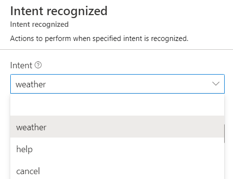
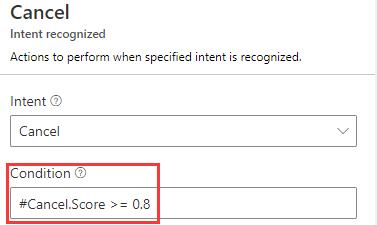
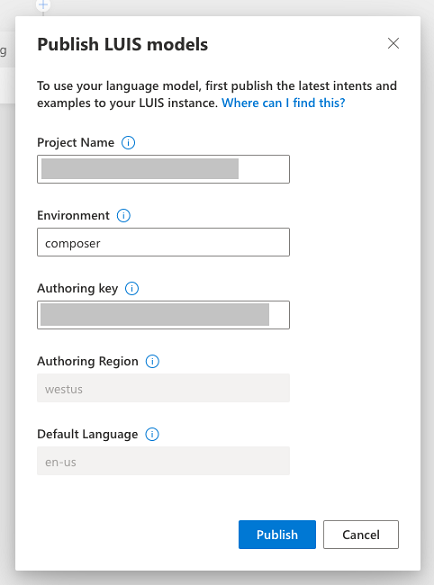

# Using LUIS for Language Understanding

Up until this point, we have been using a simple regex recognizer to detect user intent. Bot Framework Composer has deep integration with LUIS. 

Let's go ahead and update our dialog's recognizers to use luis instead. 

## Update recognizer

1. Click on `WeatherBot.Main` in the left dialog navigation panel, go to the property editor for this dialog and locate the `Recognizer type` option and set it to `LUIS`

   

2. To work with LUIS recognizer, you can provide content in the [***.lu file foramt***][2] that is highly similar to language generation format. 

   With this, intents are denoted using the markdown section notation - e.g. `# intentName` and utterances are provided as a list. 

   Replace the recognizer content with this - 
   ```
   > See https://aka.ms/lu-file-format to learn about supported LU concepts.

   > Weather intent and its utterances

   # Weather
   - get weather
   - weather
   - how is the weather

   > Help intent and its utterances

   # Help
   - help
   - i need help
   - please help
   - can you please help

   > Cancel intent and its utterances

   # Cancel
   - cancel
   - please cancel that
   - stop that
   ```

   

3. Once you have done this, you need to re-configure the various `Intent` triggers within that dialog. 
4. Click on `weather` trigger in the left navigation and choose `Weather` from the intent drop down

   Update the title of the trigger to `Weather` instead of `Intent`

   

5. Click on `cancel` trigger in the left navigation and choose `Cancel` from the intent drop down

   Update the title of the trigger to `Cancel` instead of `Intent`

6. Given we are using LUIS which is a machine learning based intent classifier, we want to avoid low confidence results. To do this, 

   Set the `Condition` property to this 

      `#Cancel.Score >= 0.8`

   

   > This says do not fire the cancel trigger if the confidence score returned by LUIS is lower than or equal to 0.8

7. Click on `help` trigger in the left navigation and choose `Help` from the intent drop down

   Update the title of the trigger to `Help` instead of `Intent`

   Set the `Condition` property to this 

      `#Help.Score >= 0.5`

   > This says do not fire the cancel trigger if the confidence score returned by LUIS is lower than or equal to 0.5

7. Click on `Restart bot`

   Composer has now detected that you have LU information specified and it needs to create/ update corresponding LUIS applications. 

   For `Authoring key`, click on `environment` in the top right corner of your screen (this is right above where this documenation content is displayed) and copy `LUIS authoring key 1` into the composer window

   

8. Click `Publish`. This should take a minute or two to complete. Composer will render progress at the top right corner of the screen.
9. Click on `Test in Emulator` and talk to the bot. 

---

With LUIS, you no longer have to type in exact regex patterns to trigger specific scenarios for your bot. Try things like:

* "How is the weather"
* "Weather please"
* "Cancel everything"
* "Not sure what I can do" 


---

## Using LUIS for entity extraction

You can use LUIS to recognize entities from what the user says. 

As an example, the user could say "How is the weather in 98052?" and instead of prompting the user again for a zipcode, we could just go straight to pulling up weather information if the user had already provided that as part of their initial query. 

Let's get this wired up. 

10. Step one is to add a regex entity extractor to the LUIS app. To do this, click on `WeatherBot.Main` and on the right side, **add** the following entity definition at the end of the LU content - 

    ```
    > regex zipcode entity. Any time LUIS sees a five digit number, it will flag it as 'zipcode' entity. 

    $ zipcode : /[0-9]{5}/
    ```

    

11. Next, let's configure your `prompt for zipcode` to use the entity if LUIS finds it. To do this, open `getWeather` dialog from the left navigtation menu, select `BeginDialog` trigger and scroll to and find the prompt.

     

12. Let's insert an action **before** the prompt by clicking on [+] -> `Manage Properties` -> `Set a property`
13. Since the prompt itself is trying to set the zipcode in the `user.zipcode`, let's set that proeperty to the `@zipcode` entity. 

      Set `Property` to 

      `user.zipcode`

      Set `Value` to

      `@zipcode`

      

14. Click on `Restart bot`, wait for the LUIS application to be updated (since you added a new entity) and then click on `Test in Emulator`

---

Now when you say "how is the weather in 98052" you should see your bot directly provide weather for that location instead of prompting you for zipcode.


---
