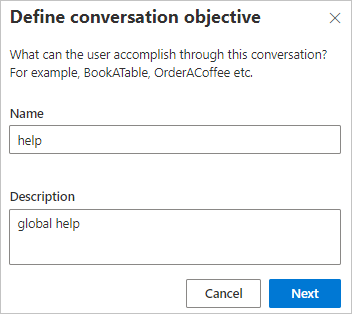
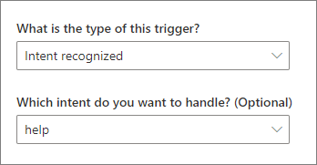
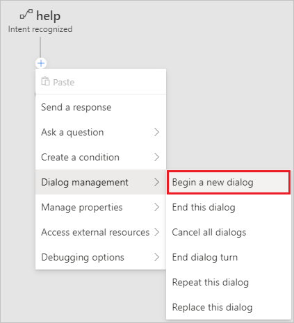
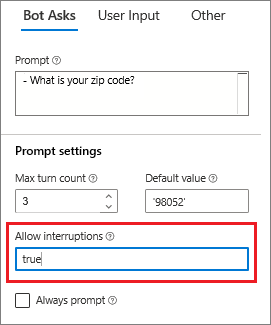
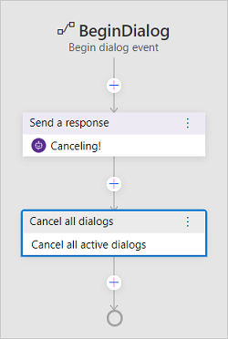

# Tutorial: Adding Help and Cancel to your bot

In this tutorial you will learn how to handle interruptions to the conversation flow. Composer enables you to add help topics to your bot and enable users to exit out of any process at any time.

In this tutorial, you learn how to:

> [!div class="checklist"]
>
> - Create help topics that can be accessed from any flow at any time.
> - Interrupt your bots flow to enable your users to exit out of any process before it is completed.

## Prerequisites

- Completion of the tutorial [Adding actions to you dialog](./tutorial-get-weather.md).

## Add Help and Cancel

With even a simple bot, it is a good practice to provide help. You'll also want to provide a way for users to exit at any point in the flow.

1. You first need to create a new dialog. Select **+ New Dialog** in the **Navigation** pane.

2. Enter **help** in the **Name** field and **global help** in the **Description** field of the **Define conversation objective** form, then select **Next**.

   

   Composer will create the new _help_ dialog with one **BeginDialog** trigger pre-configured.

3. Select the **BeginDialog** trigger in the **Navigation** pane.

4. Create a new action at the bottom of the flow by selecting the plus (+) icon in the **Authoring canvas**, then select **Send a response** from the list of actions.

   

5. Enter the following text into the **Properties** panel on the right side of the Composer screen:

   **I am a weather bot! I can tell you the current weather conditions. Just say WEATHER.**

   The next step is to connect this new _help_ dialog with the bot's main dialog.

6. Select **weatherBot** at the top of the **Navigation** pane.

   Next you will create a new [intent](../concept-language-understanding.md#intents) so that when the user enters 'help', the bots recognizer will identify that as a user intent and the bot will know what to do.

7. Create a new intent in the **RegEx patterns to intents** section of the **Properties** panel by entering **help** in both the **Intent** and **Pattern** fields, then press the enter key on your keyboard to ensure the new values are saved.

   > [!IMPORTANT]
   > You need to enter values into both the **Intent** and **Pattern** fields then press enter or the new intent will not be saved correctly.

   

8. Now you will need to create a new trigger in the main dialog to handle the new intent. You do this by selecting **+ New Trigger** in the **Navigation** pane.

9. The **Create a trigger** form will appear. Select **Intent recognized** as the trigger type and **help** from the list of intents, then select the **Submit** button.

   

10. Next select the **+** button in the **Authoring Canvas** to create a new action, then select **Begin a new dialog** from the **Dialog management** menu.

    

11. Next you need to specify the dialog to call when the _help_ intent is recognized. You do this by selecting **help** from the **Dialog name** drop-down list in the **Properties** panel.

    

    Now, in addition to giving you the current weather, your bot should now also offer help. You can verify this using the Emulator.

12. Select **Restart Bot** and open it in the Emulator to verify you are able to call your new help dialog.

    

However, notice that once you start the weather dialog by saying weather, your bot doesn't know how to provide help, it is still trying to resolve the zip code. You need to configure your bot to allow interruptions to the dialogs flow before this will work.

### Allowing interruptions

The **getWeather** dialog handles getting the weather forecast, so you will need to configure its flow to enable it to handle interruptions, which will enable the new help functionality to work. The following steps demonstrate how to do this.

1. Select the **BeginDialog** trigger in the **getWeather** dialog.

   

2. Select the **Text input** action in the **Authoring canvas**.

   

3) Select the **Bot Asks** tab in the **Properties** panel. In the **Prompt settings** section set the **Allow interruptions** field to `true`.

   

   > This tells Bot Framework to consult the parent dialog's recognizer, which will allow the bot to respond to **help** at the prompt as well.

4) Select **Restart Bot** and open it in the Emulator to verify you are able to call your new help dialog.

5) Say **weather** to your bot. It will ask for a zip code.

6) Now say **help**. It will now provide the global help response, even though that intent and trigger are defined in another dialog. Interruptions are a powerful way to make complex bots - more on that later.

   

You have learned how to interrupt a flow to include help functionality to your bot. Next you will learn how to add another useful global function, the ability to exit out of a flow without completing it - a cancel command.

### Global cancel

1. You first need to create a new dialog. Select **+ New Dialog** in the **Navigation** pane.

2. Enter **cancel** in the **Name** field of the **Define conversation objective** form, then select **Next**.

3. Select **+** at the bottom of the flow in the **Authoring canvas** and select **Send a response** from the list of actions.

4. In the **Properties** panel on the right side of the Composer screen, enter **Canceling!**

5. Add another action by selecting **+** at the bottom of the flow in the **Authoring canvas** then select **Cancel all dialogs** from the **Dialog management** menu.

   > [!NOTE]
   > When **Cancel all dialogs** is triggered, the bot will cancel all active dialogs, and send the user back to the main dialog.

   

   Next you will add a _cancel_ intent, the same way you added the _help_ intent in the previous section.

6. Select **weatherBot** at the top of the **Navigation** pane.

7. Create a new intent in the **RegEx patterns to intents** section of the **Properties** panel by entering **cancel** in both the **Intent** and **Pattern** fields, then press the enter key on your keyboard to ensure the new values are saved.

   

8. Now you will need to create a new trigger in the main dialog to handle the new intent. You do this by selecting **+ New Trigger** in the **Navigation** pane.

9. The **Create a trigger** form will appear. Select **Intent recognized** as the trigger type and **cancel** from the list of intents, then select the **Submit** button.

   

10. Next select the **+** button in the **Authoring Canvas** to create a new action, then select **Begin a new dialog** from the **Dialog management** menu.

    

11. Next you need to specify the dialog to call when the _cancel_ intent is recognized. You do this by selecting **cancel** from the **Dialog name** drop-down list in the **Properties** panel.

    

    Now, your users will be able to cancel out of the weather dialog at any point in the flow. You can verify this using the Emulator.

12. Select **Restart Bot** and open it in the Emulator to verify you are able to cancel.

13. Say **weather** to your bot. _It will ask for a zip code_.

14. Now say **help**. _It'll provide the global help response_.

15. Now, say **cancel**. Notice that the bot doesn't resume the weather dialog but instead, it confirms that you want to cancel, then waits for your next message.

## Next steps

- [Add Language Generation](./tutorial-lg.md) to power your bot's responses.
