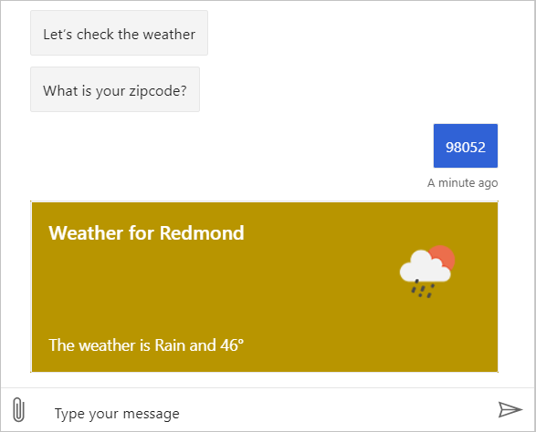

# Tutorial: Incorporating cards and buttons into your bot
The previous tutorial taught how to add language generation to your bot to include variation, conditional messages, and dynamic content that give you greater control of how your bot responds to the user, but all of your responses to the user are still in plain text format. This tutorial will build on what you learned in the previous tutorial by adding richer message content to your bot using Cards and Buttons.


In this tutorial, you learn how to:

> [!div class="checklist"]
> * Add cards and buttons to your bot using Composer

## Prerequisites
- Completion of the tutorial [Adding language generation to your bot](./tutorial-lg.md).
- A working knowledge of the concepts taught in the [Language Generation](../concept-language-generation.md) article.
- A high level understanding of the concepts taught in the how to article [Sending responses with cards](../how-to-send-cards.md).
- A high level understanding of the concepts taught in the _Cards_ section of the [Design the user experience](https://docs.microsoft.com/azure/bot-service/bot-service-design-user-experience?view=azure-bot-service-4.0#cards) article.

## Using cards

The Language Generation system can also be used to render UI cards and button actions to the user. 

Next you will learn how to refine the responses provided by the weather bot to include cards and button actions. 

### Adding buttons
Buttons are added as _suggested actions_, which enable your bot to present buttons that the user can select to provide input. Suggested actions can enhance user experience by enabling them to answer a question or make a selection with a simple tap of a button, rather than having to type a response with a keyboard. 

First, update the prompt for the users zip code to include suggested actions for help and cancel actions.

1. Select the **BeginDialog** trigger in the **getWeather** dialog.

2. Select the **test input** action which is the second action in the flow.

   

3. Update the **Prompt** to include the suggested actions as shown below:

    ```
    [Activity
        Text = What is your zip code?
        SuggestedActions = help | cancel
    ]
    ```

4. Click **Restart Bot** and open it in the emulator.

    Now when you say weather to your bot, you will not only see that your bot asks you for zipcode but also presents help and cancel button as suggested actions.

    

### Adding cards

Now you can change the weather report to also include a card.

1. Next, scroll down to the bottom in the **Authoring canvas**, then select the **Send a response** node that starts with `@{DescribeWeather(dialog.weather)}...`

2. Instead of coming back with simple text response, you can respond with a weather card. To do that, replace the response with this Thumbnail Card:
    ```
    [ThumbnailCard
        title = Weather for @{dialog.weather.city}
        text = The weather is @{dialog.weather.weather} and @{dialog.weather.temp}&deg;
        image = @{dialog.weather.icon}
    ]
    ```

3. Select **Restart Bot** in the Composer **Toolbar** then **Test in Emulator**.

In the Emulator, go through the bot flow, say **weather** followed by a zip code. Notice now the bot responds back with a card that contains the results along with a card title and image.

   

---

## Next steps
- [Tutorial: Adding LUIS functionality to your bot](./tutorial-luis.md)
