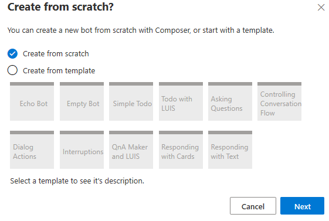
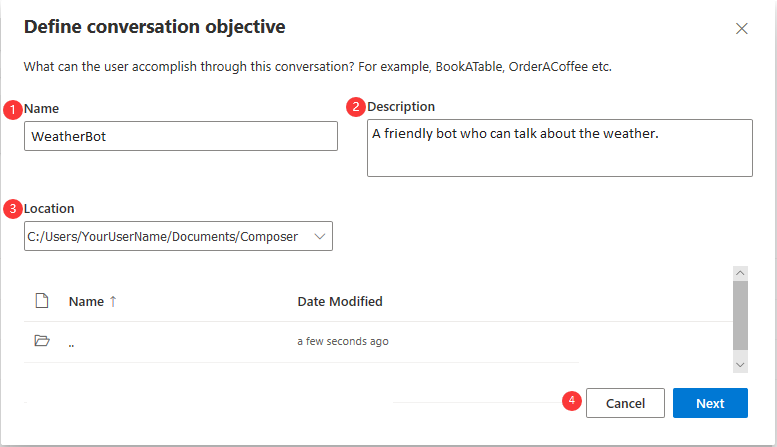
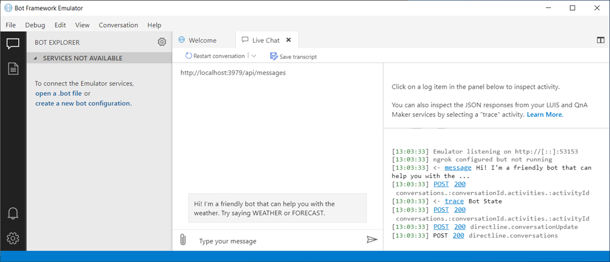

# Tutorial: Create a new bot and test it in the Emulator

This tutorial walks you through creating a basic bot with the Bot Framework Composer and testing it in the Emulator.

In this tutorial, you will learn how to:

> [!div class="checklist"]
> * Create a basic bot using the Bot Framework Composer
> * Run your bot locally and test it using the Bot Framework Emulator

## Prerequisites
- The [Bot Framework Composer](../setup-yarn.md)
- The [Bot Framework Emulator](https://aka.ms/bot-framework-emulator-readme)

## Create a new bot project
The first step in creating a bot with the Bot Framework Composer is to create a new bot project from the home screen in the Composer. This will create a new folder locally on your computer with all the files necessary to build, test and run the bot.

1. From the home screen, select **New**.

   

2. In the **Create from scratch?** screen, you'll be presented with options to create an empty bot project from scratch or to create one based on a template. For this tutorial, select the **Create from Scratch** option, then **Next**.

   

3. In the **Define conversation objective** form:
    1. Enter the name **WeatherBot** in the **Name** field.
    2. Enter **A friendly bot who can talk about the weather** in the **Description** field.
    3. Select the location to save your bot.
    4. Save your changes and create your new bot by selecting **Next**.

      

      > [!TIP] 
      > Spaces and special characters are not allowed in the bot's name.

   After creating your bot, Composer will load the new bot's main dialog in the editor. It should look like this:

   

   > [!NOTE]
   > Each dialog contains one or more [triggers](../concept-events-and-triggers.md) that define the actions available to the bot while the dialog is active. When you create a new bot, an **Activities** trigger of type **Greeting (ConversationUpdate activity)** is automatically provisioned. Triggers help your dialog capture events of interest and respond to them using actions.

   > [!TIP] 
   > To help keep bots created in Composer organized, you can rename any trigger to something that better describes what it does. 

   **Steps 4-8 are demonstrated in the image immediately following step 8.**

4. Click the **Greeting** trigger in the navigation pane.

5. In the **Properties panel** on the right side of the screen, select the trigger name and type **WelcomeTheUser**.

6. Next you will start adding functionality to your bot by adding **Actions** to the **WelcomeTheUser** trigger. You do this by selecting the **+** button in the **Authoring canvas** and select **Send a response** from the list.

   Now, it's time to make the bot do something.

   You will see the flow in the **Authoring canvas** starts with the **Trigger** name with a line below it that includes in a **+** button.

   > [!TIP] 
   > The **+** button can be used to add **Actions** to the conversation flow. You can use this to add actions to the end of a flow, or insert new actions between existing actions.

   For now, instruct the bot to send a simple greeting.

7. Select the new **Send a response** action in the flow and its properties will appear on the right hand side of the screen. This action has only one main property, the text of the activity to send.

8. Type a welcome message into this field. It is always a good idea to have your bot introduce itself and explain it's main features, something like:

   **Hi! I'm a friendly bot that can help with the weather. Try saying WEATHER or FORECAST.**

   

## Start your bot and test it

Now that your new bot has its first simple feature, you can launch it in the emulator and verify that it works.

1. Click the **Start Bot** button in the upper right hand corner of the screen.  This tells Composer to launch the bot's runtime, which is powered by the Bot Framework SDK.

2. After a second the **Start Bot** button will change to **Restart Bot** which indicates that the bots runtime has started. Simultaneously a new link will appear next to the button labeled  **Test in Emulator**.  Selecting this link will open your bot in the Emulator.

   

   Soon the Emulator will appear, and the bot should immediately greet you with the message you just configured:

   

You now have a working bot, and you're ready to add some more substantial functionality!

## Next steps
- [Add a dialog](./tutorial-add-dialog.md)
