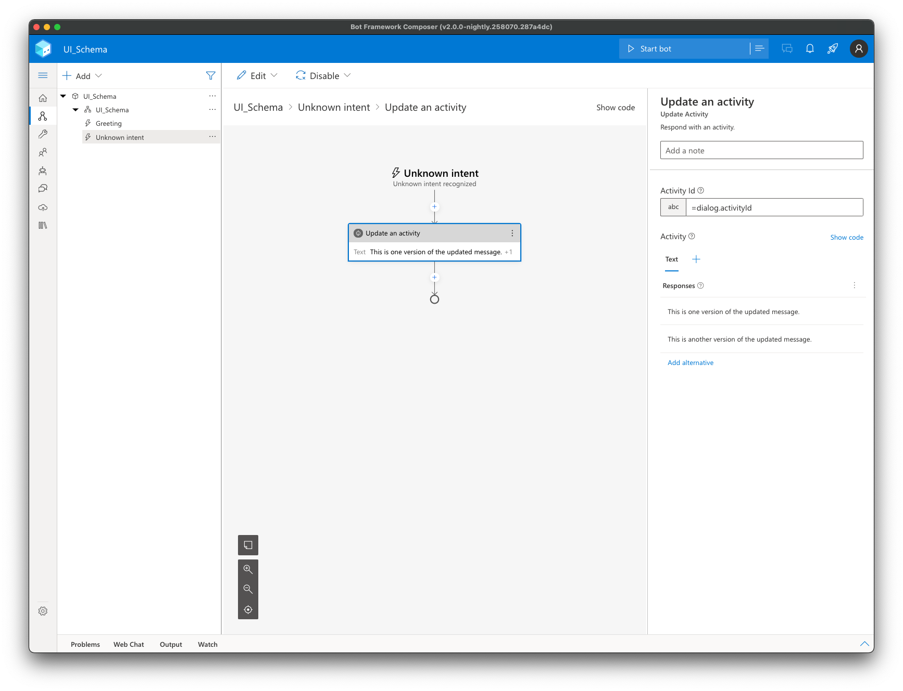

# Customizing Composer using the UI Schema

The UI schema is a sibling to the app schema file and is used to customize various aspects of Composer. This document will provide an overview of the different areas that the UI schema can customize with some examples.

Currently, there are 5 areas which are customizable using the UI schema. They are:

- [Trigger creation](#triggers)
- [Action flyout menu](#action-menu)
- [Visual flow](#flow)
- [Property Editor (Form)](#form)
- [Recognizer](#recognizer)

## Creating the UI Schema

### Component Authoring

When authoring a component schema file, you can create a cooresponding \*.uischema file which automatically gets merged into the app.uischema file generated by `bf dialog:merge`. So if you were to author a component called `MyCompany.SomethingAwesome`, there would be a `MyCompany.SomethingAwesome.schema` as well as an optional (but encouraged) `MyCompany.SomethingAwesome.uischema`.

This uischema file is a json object with the optional properties `trigger`, `menu`, `flow`, and `form`.

Example:

```json
// MyCompany.SomethingAwesome.uischema
{
  "trigger": {},
  "menu": {},
  "flow": {},
  "form": {},
  "recognizer": {}
}
```

### Bot Overrides

It is also possible for bot authors to override the defaults provided by the component authors. Simply create an `app.override.uischema` in the `schemas/` directory in your bot project. This file has the same shape of the `app.uischema` and can be used to override specific properties of individual components.

Example:

```json
// app.override.uischema
{
  "Microsoft.SendActivity": {
    "form": {
      "label": "A custom form label"
    }
  }
  // ...
}
```

## Customization Options

### Triggers

The trigger ui schema is used to customize how triggers appear in the new trigger modal in Composer.

| Property   | Type                 | Description                                                          |
| ---------- | -------------------- | -------------------------------------------------------------------- |
| `label`    | `string`             | Displayed trigger name in trigger creation flow.                     |
| `submenu`  | `string` \| `object` | Configuration for where to place trigger in the creation flow.       |
| `disabled` | `boolean`            | When set to true, the trigger will be hidden from the creation flow. |
| `order`    | `number`             | Indexing order of a Trigger, be used to sort the Trigger menu.       |

<details>
  <summary>Example</summary>

```json
// Microsoft.OnActivity.uischema
{
  "trigger": {
    "label": "Activities (Activity received)",
    "order": 5.1,
    "submenu": {
      "label": "Activities",
      "prompt": "Which activity type?",
      "placeholder": "Select an activity type"
    }
  }
}
```


</details>

### Action Menu

The menu ui schema is used to customize the way the action appears in action menu. It can be an object or an array of objects. When an array, Composer will show the action in multiple submenus.

| Property   | Type                  | Description                                                                                                                                                                                           |
| ---------- | --------------------- | ----------------------------------------------------------------------------------------------------------------------------------------------------------------------------------------------------- |
| `label`    | `string`              | Text that appears as the menu item. Defaults to schema title.                                                                                                                                         |
| `submenu`  | `string[]` \| `false` | An array of submenu labels to configure how this component is nested in the menu, with the first item coresponding to a top-level menu. Set to false to show this component as a top-level menu item. |
| `disabled` | `boolean`             | When set to true, current $kind will be hidden from the Action flyout menu.                                                                                                                           |
| `order`    | `number`              | A float number as the indexing order of an Action, be used to sort the Action menu.                                                                                                                   |

<details>
  <summary>Example</summary>

```json
// Teams.GetMeetingInfo.uischema
{
  "menu": {
    "submenu": ["Microsoft Teams", "Get Teams Info"]
  }
}
```


</details>

### Flow

The flow ui schema is used to customize the widgets and content of the flow canvas in Composer. The main concept for the flow ui is a `widget`. Each node in the flow is a composition of 1 or more widgets. Each flow ui schema has a `widget` property with additional properties depending on which widget is being used. Outlined below are all of the widgets and their properties.

#### Composite Widgets

Composite widgets are composed of multiple widgets. There are only 2 composite widgets in Composer: `ActionCard` and `PromptWidget`.

##### `ActionCard`

The `ActionCard` widget is the primary widget for most nodes in Composer. It is the default widget used by all actions and is composed of 3 sections: `header`, `body` and `footer`.

| Property     | Type                      | Description                                                                                   |
| ------------ | ------------------------- | --------------------------------------------------------------------------------------------- |
| `widget`     | `ActionCard`              |                                                                                               |
| `header`     | `object`                  | Customization for the card header. See [below](#action-header) for more details.              |
| `body`       | `object`                  | Customization for the card body. See [below](#body-widgets) for more details.                 |
| `footer`     | `object`                  | Customization for the footer widget. See [below](#footer-widgets) for more details.           |
| `hideFooter` | `expression` \| `boolean` | When true, the card footer is hidden. Can be an expression evaluated with the action context. |

<details>
  <summary>Example</summary>

```json
// Microsoft.BeginSkill.uischema
{
  "flow": {
    "widget": "ActionCard",
    "body": {
      "widget": "ResourceOperation",
      "operation": "Host",
      "resource": "=coalesce(action.skillEndpoint, \"?\")",
      "singleline": true
    },
    "header": {
      "widget": "ActionHeader",
      "colors": {
        "theme": "#004578",
        "color": "#FFFFFF",
        "icon": "#FFFFFF"
      },
      "icon": "Library"
    },
    "footer": {
      "widget": "PropertyDescription",
      "property": "=action.resultProperty",
      "description": "= Result"
    },
    "hideFooter": "=!action.resultProperty"
  }
}
```


</details>

##### `PromptWidget`

The `PromptWidget` widget is used as a composite widget for prompts. It combines 2 action cards and a custom node.

| Property    | Type           | Description                                                            |
| ----------- | -------------- | ---------------------------------------------------------------------- |
| `widget`    | `PromptWidget` |                                                                        |
| `botAsks`   | `object`       | An [`ActionCard`](#action-card) widget configuration.                  |
| `userInput` | `object`       | An [`ActionCard`](#action-card) widget configuration.                  |
| `nowrap`    | `true`         | Allows Composer to render this as a single node with multiple widgets. |

<details>
  <summary>Example</summary>

```json
// Microsoft.ConfirmInput.uischema
{
  "flow": {
    "widget": "PromptWidget",
    "nowrap": true,
    "botAsks": {
      "widget": "ActionCard",
      "header": {
        "widget": "ActionHeader",
        "icon": "MessageBot",
        "colors": {
          "theme": "#EEEAF4",
          "icon": "#5C2E91"
        }
      },
      "body": {
        "widget": "LgWidget",
        "field": "prompt",
        "defaultContent": "<prompt>"
      }
    },
    "userInput": {
      "widget": "ActionCard",
      "header": {
        "widget": "ActionHeader",
        "disableSDKTitle": true,
        "icon": "User",
        "menu": "none",
        "colors": {
          "theme": "#E5F0FF",
          "icon": "#0078D4"
        }
      },
      "body": {
        "widget": "PropertyDescription",
        "property": "=action.property",
        "description": "= Input(Confirm)"
      }
    }
  }
}
```


</details>

#### Header Widgets

##### `ActionHeader`

The `ActionHeader` is the only header widget in Composer. Use it to customize the node header.

| Property          | Type           | Description                                                                                       |
| ----------------- | -------------- | ------------------------------------------------------------------------------------------------- |
| `widget`          | `ActionHeader` |                                                                                                   |
| `title`           | `string`       | Customize the header text.                                                                        |
| `icon`            | `string`       | Fluent icon name. [List of available icons](https://uifabricicons.azurewebsites.net/).            |
| `colors`          | `object`       |                                                                                                   |
| `colors.theme`    | `string`       | Background color of the header.                                                                   |
| `colors.color`    | `string`       | Color of the header text.                                                                         |
| `colors.icon`     | `string`       | Background color of the icon.                                                                     |
| `disableSDKTitle` | `boolean`      | When true, force usage of `title`.                                                                |
| `menu`            | `none`         | When `'none'`, Composer does not render the node menu. (Used in [`PromptWidget`](#prompt-widget)) |

<details>
  <summary>Example</summary>

```json
// Microsoft.SendActivity.uischema
{
  "flow": {
    "widget": "ActionCard",
    "header": {
      "widget": "ActionHeader",
      "icon": "MessageBot",
      "colors": {
        "theme": "#EEEAF4",
        "icon": "#5C2E91"
      }
    }
  }
}
```


</details>

#### Body Widgets

##### `DialogRef`

The `DialogRef` widget is used for actions that invoke other dialogs. It is a special widget that includes a link to the invoked dialog.

| Property | Type        | Description                                               |
| -------- | ----------- | --------------------------------------------------------- |
| `widget` | `DialogRef` |                                                           |
| `dialog` | `string`    | The id of the dialog being invoked. Can be an expression. |

<details>
  <summary>Example</summary>

```json
// Microsoft.BeginDialog.uischema
{
  "flow": {
    "widget": "ActionCard",
    "body": {
      "widget": "DialogRef",
      "dialog": "=action.dialog"
    }
  }
}
```


</details>

##### `PropertyDescription`

The `PropertyDescription` is used to display the value of a dialog property with a label.

| Property      | Type                  | Description                                             |
| ------------- | --------------------- | ------------------------------------------------------- |
| `widget`      | `PropertyDescription` |                                                         |
| `property`    | `string`              | The property value to display. Typically an expression. |
| `description` | `string`              | Label to display next to property value.                |

<details>
  <summary>Example</summary>

```json
// Microsoft.CancelAllDialogs.uischema
{
  "flow": {
    "widget": "ActionCard",
    "body": {
      "description": "(Event)",
      "property": "=coalesce(action.eventName, \"?\")",
      "widget": "PropertyDescription"
    }
  }
}
```


</details>

##### `LgWidget`

The `LgWidget` is used to display the value of a dialog property with a label.

| Property         | Type       | Description                                                  |
| ---------------- | ---------- | ------------------------------------------------------------ |
| `widget`         | `LgWidget` |                                                              |
| `field`          | `string`   | The property on the dialog which contains a reference to LG. |
| `defaultContent` | `string`   | Fallback value to render if the LG property is empty.        |

<details>
  <summary>Example</summary>

```json
// Microsoft.UpdateActivity.uischema
{
  "flow": {
    "widget": "ActionCard",
    "body": {
      "widget": "LgWidget",
      "field": "activity"
    }
  }
}
```



</details>

##### `ResourceOperation`

The `ResourceOperation` is used to show an operation. It contains an operation verb and a resource being operated on.

| Property     | Type                | Description                                                    |
| ------------ | ------------------- | -------------------------------------------------------------- |
| `widget`     | `ResourceOperation` |                                                                |
| `operation`  | `string`            | The operation being performed. Can be a string or expression.  |
| `resource`   | `string`            | The resource being operated on. Can be a string or expression. |
| `singleline` | `boolean`           | Prevents the text in the node from wrapping. Default: false    |

<details>
  <summary>Example</summary>

```json
// Microsoft.EditArray.uischema
{
  "flow": {
    "widget": "ActionCard",
    "body": {
      "widget": "ResourceOperation",
      "operation": "=coalesce(action.changeType, \"?\")",
      "resource": "=coalesce(action.itemsProperty, \"?\")"
    }
  }
}
```


</details>

##### `ListOverview`

The `ListOverview` is used to show an operation. It contains an operation verb and a resource being operated on.

| Property | Type           | Description                                                         |
| -------- | -------------- | ------------------------------------------------------------------- |
| `widget` | `ListOverview` |                                                                     |
| `items`  | `string`       | Expression evaluating to array of strings to display as list items. |

<details>
  <summary>Example</summary>

```json
// Microsoft.SetProperties.uischema
{
  "flow": {
    "widget": "ActionCard",
    "body": {
      "widget": "ListOverview",
      "items": "=foreach(action.assignments, x => concat(coalesce(x.property, \"?\"), \" : \", coalesce(x.value, \"?\")))"
    }
  }
}
```


</details>

#### Footer Widgets

##### `PropertyDescription`

See above.

### Form

### Recognizer

The recognizer ui schema allows customization of LU authoring in Composer.

| Property       | Type                                    | Description                                                               |
| -------------- | --------------------------------------- | ------------------------------------------------------------------------- |
| `displayName`  | `string`                                | The recognizer name used in the Composer UI.                              |
| `intentEditor` | `LuIntentEditor` \| `RegexIntentEditor` | LU editor widget.                                                         |
| `default`      | `boolean`                               | If true, new dialogs will use this recognizer by default.                 |
| `disabled`     | `boolean`                               | If true, the recognizer will be hidden from the available recognizers.    |
| `order`        | `number`                                | Indexing order of the recognizer. Used to sort the available recognizers. |
