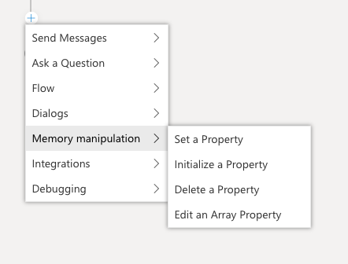

# Using Memory

All bots built with Bot Framework Composer have a "memory" - a representation of everything that is currently in the bot's active mind.
Developers can store and retrieve values in the bot memory, and can use those values to create loops, branches, dynamic messages and behaviors in the bot.
Properties from memory can be used inside templates, and can also be used as part of a calculation.

## Anatomy of a Property in Memory

A piece of data in memory is referred to as a **property** - this is a distinct value identified by a specific address.  The address is made up of two parts - the first part is the **scope** of the property, and the second is the **name** of the property.

Here are a couple of examples:

* `user.name`
* `turn.activity`
* `dialog.index`
* `user.profile.age`

The scope of the property determines when the property is available, and how long the value will be retained.

The bot's memory has 2 "permanent" scopes - a place to store information about individual users, and a place to store information about ongoing conversations:

* **user** is associated with a specific user. Properties in the user scope are retained forever.
* **conversation** is associated with the conversation id. Properties in the user scope are retained forever - and may be accessed by multiple users within the same conversation (for example multiple users together in an MS Teams channel).

The bot's memory also has 2 "ephemeral" scopes - a place to store temporary values that are only relevant while a task is being handled:

* **dialog** is associated with the active dialog and any child or parent dialogs. Properties in the dialog scope are retained until the last active dialog ends.
* **turn** is associated with a single turn (handling of a single message from the user). Properties in the turn scope are discarded at the end of the turn.

## Set Properties using Memory Actions

Bot Framework provides a set of memory manipulation actions to create and modify properties in memory. Properties can be created on the fly in the Composer editor - the bot runtime will automatically manage the underlying data for you in the background.

Use **Set a Property** to set the value of a property. For example, set `user.onboarded` to `true`. The value of a property can be set to a literal value, like `true`, 0, or `fred`, or it can be set to the result of an [computed expression](#expressions).

Use **Initialize a Property** to create new properties that are objects or arrays. For example, initialize `user.profile` to `{}`. This allows your bot to use sub-properties, or store multiple values inside the property.  

It is important to note that before setting the value of a sub-property like `user.profile.age`, the `user.profile` must first be initialized. It is not necessary to further initialize `user.profile.age` unless `age` must also contain sub-values.

Use **Edit an Array Property** to add and remove items from an array. Items can be added or removed from the top or bottom of an array using push, pop and take. Items can also be removed from an array.

Use **Delete a Property** to remove a property from memory.

## Automatic Properties

Some properties are automatically created and managed by the bot. These are available automatically.

|Property |Description
|-- |--
| turn.activity | The full incoming [Activity](https://docs.microsoft.com/en-us/javascript/api/botframework-schema/activity?view=botbuilder-ts-latest) object
| turn.intents | If a recognizer is run, the intents found
| turn.entities | If a recognizer is run, the entities found
| turn.dialogEvents.[event name].value | Payload of a custom event fired using the EmitEvent action.

## Expressions

## Memory in Conditions

## Memory in LG

## Further Reading

* [Bot Framework Adaptive Dialogs Memory Model](https://github.com/microsoft/BotBuilder-Samples/blob/master/experimental/adaptive-dialog/docs/memory-model-overview.md)

* [Bot Framework on Github](https://github.com/microsoft/botframework)

## Next

* [Overview of Bot Framework Composer](overview_of_bfd.md) 