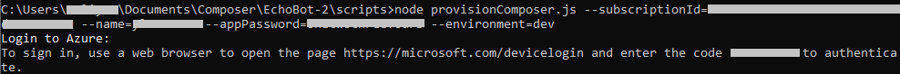
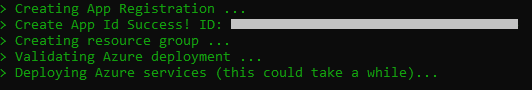

# Manually provision and publish a bot to Azure (_Preview_)

This article covers script-based instructions to manually provision and publish a bot built using Composer to _Azure Web App (Preview)_ and _Azure Functions (Preview)_.

## Prerequisites

- A subscription to [Microsoft Azure](https://azure.microsoft.com/free/).
- [A basic bot built using Composer](https://aka.ms/composer-create-first-bot).
- Latest version of the [Azure CLI](https://docs.microsoft.com/cli/azure/install-azure-cli).
- [Node.js](https://nodejs.org/). Use version 12.13.0 or later.
- PowerShell version 6.0 and later.

## Provision Azure resources

This section covers steps to provision required Azure resources using JavaScript scripts. If you already have your Azure resources provisioned, skip to the [publish a bot to Azure](#publish-a-bot-to-azure) section.

Follow these instructions to manually provision Azure resources:

1. Open a new Command Prompt and navigate to the **scripts** folder of your bot's project folder. For example:

    ```cmd
    cd C:\Users\UserName\Documents\Composer\BotName\scripts
    ```

2. Run the following command:

   ```cmd
   npm install
   ```

3. Then run the following command to provision new Azure resources.

   - **_Azure Web App (Preview)_**:

   ```cmd
   node provisionComposer.js --subscriptionId=<YOUR AZURE SUBSCRIPTION ID> --name=<NAME OF YOUR RESOURCE GROUP> --appPassword=<APP PASSWORD> --environment=<NAME FOR ENVIRONMENT DEFAULT to dev>
   ```

   - **_Azure Functions (Preview)_**:

   ```cmd
   node provisionComposer.js --subscriptionId=<YOUR AZURE SUBSCRIPTION ID> --name=<NAME OF YOUR RESOURCE GROUP> --appPassword=<APP PASSWORD> --environment=<NAME FOR ENVIRONMENT DEFAULT to dev> --customArmTemplate=DeploymentTemplates/function-template-with-preexisting-rg.json
   ```

   | Property | Value |
   |----|----|
   |Your Azure Subscription ID| Find it in your Azure resource in the **Subscription ID** field. |
   |Name of your resource group| The name you give to the resource group you are creating. |
   |App password|At least 16 characters with at least one number, one letter, and one special character. |
   |Name for environment| The name you give to the publish environment. |

4. You will be asked to login to the Azure portal in your browser.

    > 

5. If you see the error message "InsufficientQuota", add a param '--createLuisAuthoringResource false' and run the script again.

    - **_Azure Web App_**:

    ```cmd
    node provisionComposer.js --subscriptionId=<YOUR AZURE SUBSCRIPTION ID> --name=<NAME OF YOUR RESOURCE GROUP>--appPassword=<APP PASSWORD> --environment=<NAME FOR ENVIRONMENT DEFAULT to dev> --createLuisAuthoringResource false
    ```

    - **_Azure Functions_**:

    ```cmd
    node provisionComposer.js --subscriptionId=<YOUR AZURE SUBSCRIPTION ID> --name=<NAME OF YOUR RESOURCE GROUP> --appPassword=<APP PASSWORD> --environment=<NAME FOR ENVIRONMENT DEFAULT to dev> --createLuisAuthoringResource false --customArmTemplate=DeploymentTemplates/function-template-with-preexisting-rg.json
    ```

    > [!NOTE]
    > If you use `--createLuisAuthoringResource false` in this step, you should manually add the LUIS authoring key to the publish configuration in the [deploy bot to new Azure resources](#deploy-bot-to-new-azure-resources) section. The default region is `westus`. To provision to other regions, you should add `--location region`.

6. As the Azure resources are being provisioned, which takes a few minutes, you will see the following:

    > [!div class="mx-imgBorder"]
    > 

    Once completed, the generated JSON appears in the command line like the following.

      ```json
      {
        "accessToken": "<SOME VALUE>",
        "name": "<NAME OF YOUR RESOURCE GROUP>",
        "environment": "<ENVIRONMENT>",
        "hostname": "<NAME OF THE HOST>",
        "luisResource": "<NAME OF YOUR LUIS RESOURCE>",
        "settings": {
          "applicationInsights": {
            "InstrumentationKey": "<SOME VALUE>"
          },
          "cosmosDb": {
            "cosmosDBEndpoint": "<SOME VALUE>",
            "authKey": "<SOME VALUE>",
            "databaseId": "botstate-db",
            "collectionId": "botstate-collection",
            "containerId": "botstate-container"
          },
          "blobStorage": {
            "connectionString": "<SOME VALUE>",
            "container": "transcripts"
          },
          "luis": {
            "endpointKey": "<SOME VALUE>",
            "authoringKey": "<SOME VALUE>",
            "region": "westus"
          },
          "qna": {
            "endpoint": "<SOME VALUE>",
            "subscriptionKey": "<SOME VALUE>"
          },
          "MicrosoftAppId": "<SOME VALUE>",
          "MicrosoftAppPassword": "<SOME VALUE>"
        }
      }
      ```

    Once completed, the provision scripts will create the following resources in Azure portal:

    | Resource | Required/Optional |
    | -------- | ----------------- |
    | App Service plan | Required |
    | App Service | Required |
    | Application Registration | Required |
    | Azure Cosmos DB | Optional |
    | Application Insights | Optional |
    | Azure Blob Storage | Optional |
    | LUIS authoring resource (Cognitive Services)| Optional |
    | LUIS prediction resource (Cognitive Services)| Optional |
    | QnA Maker resources (Cognitive Services) | Optional |

## Publish a bot to Azure

This section covers instructions to publish a bot to Azure using PowerShell scripts. Make sure you already have required Azure resources provisioned before publishing a bot, if not, follow these instructions from the [provision Azure resources](#provision-azure-resources) section.

Follow these steps to manually publish a bot to Azure:

1. Install the required dependencies.

    bf command

   ```cmd
   npm i -g @microsoft/botframework-cli@next
   ```

   bf plugins

    ```cmd
   bf plugins:install @microsoft/bf-sampler-cli@beta
   ```

2. [Eject your C# runtime](https://aka.ms/composer-customize-action#export-runtime).

3. Navigate to your runtime's azurewebapp folder, for example `C:\user\test\ToDoBot\runtime\azurewebapp` and execute the following command under the `azurewebapp` folder:

    ```powershell
    .\Scripts\deploy.ps1 -name <name of resource group> -hostName <hostname of azure webapp> -luisAuthoringKey <luis authoring key> -qnaSubscriptionKey <qna subscription key> -environment <environment>
    ```

4. Alternatively, if you have saved your publishing profile in json format (profile.json), execute the following command:

    ```powershell
    .\Scripts\deploy.ps1 -publishProfilePath < path to your publishing profile>
    ```

  The following is a table of the deploy.ps1 parameters:

  | Parameter | Description  |
  | ----------|--------------|
  | name      | name of your Bot Channels Registration|
  | environment | environment, which is the same as Composer |
  | hostName | Hostname of your azure webapp instance|
  | luisAuthoringKey | luis authoring key, only needed with luis resources|
  | luisAuthoringRegion | luis authoring region, this could be optional|
  | qnaSubscriptionKey | qna subscription key, only needed with qna resources|
  | language | language of your qna & luis, defaults to 'en-us' |
  | botPath | path to your bot assets, defaults to `../../` for ejected runtime |
  | logFile | path to save your log file, defaults to `deploy_log.txt` |
  | runtimeIdentifier | runtime identifier of your C# publishing targets, defaults to win-x64, read more in [this doc](https://docs.microsoft.com/en-us/dotnet/core/rid-catalog) |
  | luisResource | the name of your luis prediction (not authoring) resource |
  | publishProfilePath | the path to your publishing profile (in json format) |

## Refresh your Azure Token

Follow these steps to get a new token if you encounter an error about your access token being expired:

- Open a terminal window.
- Run `az account get-access-token`.
- This will result in a JSON object containing the new `accessToken`, printed to the console.
- Copy the value of the accessToken from the terminal and into the publish `accessToken` field in the profile in Composer.

## Known issues

- The provision and publish flow from Composer UI is limited to  Microsoft account only now. A personal Microsoft account (non-work / school) then authentication will not work.
-