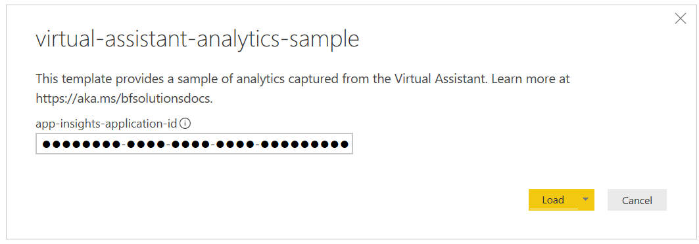

# Tutorial: View analytics with Power BI

## Open the Power BI template

1. Open the [Bot Composer analytics template](./Power-BI-Report-Composer.pbit) and paste your **Application Insights Application ID**.

1. After loading the tables with your populated data, you should now see insights from your Virtual Assistant.

*Note: You may run into authentication issues when opening the template, particularly if you have opened the template previously using another Application ID. If so, perform the following steps to re-authenticate the template with your Application Insights service:*

1. Open the Template
2. File > Options and Settings > Data Source Settings
3. Click "Global permissions"
4. Click on anything resembling "api.logalytics.io" and Clear Permissions > Clear Permissions > Delete
5. Close and Re-open the Template
6. Paste your Application Insights AppId
7. Click Load
8. *Important*: Select Organizational Account > Sign In > Connect

## Additional Telemetry

By default, a Bot composer Bot based project collects personally identifiable information (e.g. Conversation drill-down and transcripts) which will lead to the respective sections in the PowerBI dashboard to function as expected. If you wish to not collect this information make the changes to `appsettings.json` by following this article: https://docs.microsoft.com/en-us/composer/how-to-capture-telemetry?tabs=v2x#configure-telemetry
